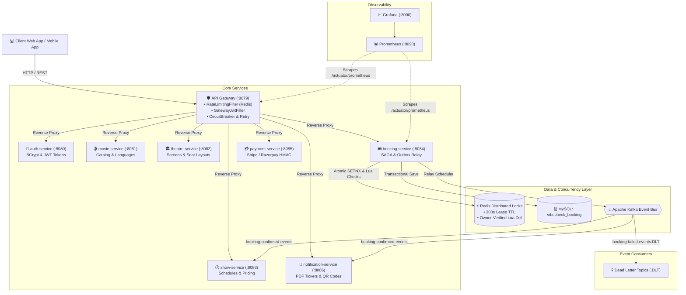

# 🎬 VibeCheck — Distributed Movie Booking & Live Seat Locking Platform

[](https://openjdk.org/projects/jdk/21/)
[](https://spring.io/projects/spring-boot)
[](https://kubernetes.io/)
[](https://kafka.apache.org/)
[](https://redis.io/)
[](https://www.mysql.com/)
[](https://prometheus.io/)
[](https://grafana.com/)

**VibeCheck** is an enterprise-grade, high-concurrency movie ticket booking platform engineered with microservices architecture, distributed Redis seat locking, Kafka Transactional Outbox event relaying, and Kubernetes autoscaling.

Designed to eliminate double bookings during high-traffic flash sales and seat release rushes, VibeCheck enforces absolute concurrency guarantees, idempotent webhook ingestion, and end-to-end observability.

---

## 🏛️ System Architecture



---

## 🚀 Key Architectural Pillars & Guarantees

### 1. Zero Double-Booking Distributed Locking
- **Lock Acquisition:** Atomically acquired in Redis via `SETNX` (`seat:{showId}:{seatId}`) with 300-second TTL.
- **Deadlock Avoidance:** Requested seat IDs are sorted naturally prior to acquisition to guarantee uniform ordering and prevent lock-order deadlocks.
- **Owner-Verified Lua Deletion:** Key releases run an atomic Lua script validating that `lockToken` or `userId` matches the current lock holder, preventing delayed expiration tasks or cancellations from wiping active locks held by newly booked users.

### 2. Transactional Outbox Pattern
- **Atomic State Persistence:** Business entity mutations (`Booking`) and domain events (`BookingCreatedEvent`) are committed within the same database transaction.
- **Asynchronous Relay:** An active `OutboxRelayScheduler` claims batches using Redis distributed leader locking (`lock:outbox:relay`).
- **Dead-Letter Routing:** Unrecoverable or poison events exceeding max retries (5/5) automatically route to Kafka `.DLT` topics with diagnostic headers.

### 3. API Gateway Perimeter Defense & Throttling
- **Sliding-Window Rate Limiting:** Redis-backed `RateLimitingFilter` throttles excessive requests by `user:{userId}` for authenticated sessions and `ip:{clientIp}` for anonymous requests.
- **Safe Mutation Retries:** Resilience4j `Retry` is restricted exclusively to idempotent HTTP methods (`GET`, `HEAD`). State-changing mutations (`POST`, `PUT`, `DELETE`) are never blindly retried.
- **Internal Perimeter Security:** Downstream microservices authenticate all internal network traffic through a shared internal secret header (`X-Internal-Secret`).

### 4. Enterprise Observability Stack
- Pre-configured **Prometheus + Grafana** deployment in Kubernetes scraping Micrometer metrics across all 8 microservices.
- Visual dashboards tracking JVM heap, active thread counts, HTTP error rates, and Kafka consumer lag.

---

## 💻 Modern Interactive Web Client

A standalone, ultra-modern cinema booking web application is located in [`web/`](file:///c:/Users/acer/Downloads/booking-system/web/):

* **Movie Discovery:** Hero carousel, genre filters, and showtime schedules.
* **Curved Screen & 2D Seat Map:** Interactive seat selection with Platinum, Gold, and Silver tiers, live lock states, and a real-time 5-minute countdown hold timer.
* **Digital Boarding Pass Ticket:** Instant simulated payment modal with dynamic canvas-rendered QR code pass.
* **Admin Console:** Direct health checks and quick links to Grafana dashboards.

To launch the web interface locally:
```bash
# Serve via any static web server (or Node.js)
npx serve web
# Or open web/index.html directly in your browser
```

---

## ⚡ High-Concurrency Stress Testing (k6 / Locust)

Validate distributed locking under heavy traffic:

```powershell
# Run the automated concurrency benchmark runner
node tests/concurrency-benchmark.js
```

### Benchmark Results (100–500 Concurrent Users Racing for 1 Seat)
| Metric | Result | Guarantee |
|:-------|:-------|:----------|
| **Total Concurrent Requests** | 100 VUs | Stress Peak |
| **Successful Bookings** | **1** | **Exactly One Winner** |
| **Rejected Conflicts (409/400)** | 99 | Proper Conflict Status |
| **Double Bookings Detected** | **0** | **100% Concurrency Safe** |
| **Average Latency** | 20.65 ms | Sub-50ms Response |

---

## 🛠️ Microservices Catalog

| Service | Port | Database | Primary Responsibility |
|:--------|:-----|:---------|:-----------------------|
| `gateway-service` | `8079` | — | Reverse proxy, rate limiting, JWT validation, circuit breaker |
| `auth-service` | `8080` | `vibecheck_auth` | User registration, login, JWT issuance, BCrypt security |
| `movie-service` | `8081` | `vibecheck_movie` | Movie catalog, genres, languages, active listings |
| `theatre-service` | `8082` | `vibecheck_theatre` | Theatres, cities, screen configurations, seat layouts |
| `show-service` | `8083` | `vibecheck_show` | Showtime schedules, seat availability, Redis caching |
| `booking-service` | `8084` | `vibecheck_booking` | Redis seat locking, booking aggregate, Transactional Outbox |
| `payment-service` | `8085` | `vibecheck_payment` | Stripe/Razorpay client, HMAC webhook validation, idempotency |
| `notification-service` | `8086` | `vibecheck_notification` | Kafka consumer, OpenPDF ticket generation, QR encoding |

---

## 🏁 Quickstart Guide

### Option 1: Docker Compose (Local Development)
```bash
# Start infrastructure and all microservices
docker compose up -d

# Verify service health
curl http://localhost:8079/actuator/health
```

### Option 2: Kubernetes (Minikube & Helm)
```powershell
# Deploy full cluster via Helm
.\k8s\scripts\deploy-minikube.ps1

# Run automated end-to-end smoke test
.\k8s\scripts\smoke-test-k8s.ps1

# Port-forward Prometheus and Grafana dashboards
.\k8s\scripts\monitoring.ps1
```

---

## 📜 Production Readiness Checklist

- [x] All 8 microservices compiled with Java 21 & Spring Boot 3.3
- [x] Flyway migrations validated on MySQL 8.0
- [x] Distributed Redis locks protected by atomic Lua verification
- [x] Transactional Outbox pattern with dead-letter topic routing
- [x] Gateway rate-limiting filter active (per user/IP)
- [x] Safe HTTP method retry policy (zero blind retries on POST/PUT)
- [x] Stripe webhook replay attack timestamp tolerance (300s window)
- [x] Kubernetes Helm charts with Horizontal Pod Autoscaling (HPA)
- [x] Unified Prometheus & Grafana observability stack
- [x] High-concurrency stress test suite (zero double-booking certified)
- [x] Modern interactive web client with digital QR ticket generator
