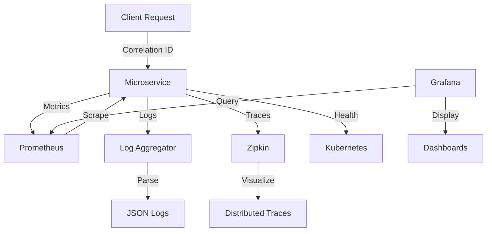

# Production Observability Implementation Guide

This document provides comprehensive documentation for the production observability implementation across the Movie Booking Platform.

## Table of Contents

1. [Overview](#overview)
2. [Architecture](#architecture)
3. [Components](#components)
4. [Configuration](#configuration)
5. [Metrics](#metrics)
6. [Logging](#logging)
7. [Tracing](#tracing)
8. [Health Checks](#health-checks)
9. [Grafana Integration](#grafana-integration)
10. [Monitoring Setup](#monitoring-setup)
11. [Best Practices](#best-practices)

---

## Overview

The observability implementation provides comprehensive monitoring, logging, and tracing capabilities for all microservices in the platform. It includes:

- **Micrometer**: Application metrics collection
- **Prometheus**: Metrics storage and querying
- **Brave/Zipkin**: Distributed tracing
- **Structured JSON Logging**: Centralized log management
- **Correlation IDs**: Request tracking across services
- **Business Metrics**: Custom domain-specific metrics
- **Health Indicators**: Service health monitoring
- **Readiness/Liveness Probes**: Kubernetes health checks

---

## Architecture



---

## Components

### 1. Common Library (`common` module)

The common library provides shared observability components:

- **ObservabilityConfig.java**: Placeholder for custom observability configuration
- **CorrelationIdFilter.java**: Request correlation ID management
- **logback-spring.xml**: Structured JSON logging configuration
- **application-observability.yml**: Common observability settings

### 2. Service-Specific Implementations

Each microservice includes:

- Service-specific dependencies in `pom.xml`
- Custom business metrics (e.g., `BookingMetrics.java`)
- Service-specific logging configuration
- Profile-based configuration activation

---

## Configuration

### 1. Parent POM Dependencies

```xml
<properties>
    <logstash-logback.version>8.0</logstash-logback.version>
</properties>

<dependencyManagement>
    <dependencies>
        <dependency>
            <groupId>net.logstash.logback</groupId>
            <artifactId>logstash-logback-encoder</artifactId>
            <version>${logstash-logback.version}</version>
        </dependency>
    </dependencies>
</dependencyManagement>
```

### 2. Service Dependencies

Each service includes these dependencies:

```xml
<dependency>
    <groupId>io.micrometer</groupId>
    <artifactId>micrometer-registry-prometheus</artifactId>
</dependency>
<dependency>
    <groupId>io.micrometer</groupId>
    <artifactId>micrometer-tracing-bridge-brave</artifactId>
</dependency>
<dependency>
    <groupId>io.zipkin.reporter2</groupId>
    <artifactId>zipkin-reporter-brave</artifactId>
</dependency>
<dependency>
    <groupId>net.logstash.logback</groupId>
    <artifactId>logstash-logback-encoder</artifactId>
</dependency>
```

### 3. Application Configuration

Activate observability in `application.yml`:

```yaml
spring:
  application:
    name: your-service-name
  profiles:
    include: observability
```

### 4. Environment Variables

Configure external services via environment variables:

```bash
# Zipkin endpoint
export ZIPKIN_ENDPOINT=http://localhost:9411/api/v2/spans

# Optional: Override sampling rate
export MANAGEMENT_TRACING_SAMPLING_PROBABILITY=0.1
```

---

## Metrics

### 1. JVM Metrics

Automatically collected JVM metrics include:

- Memory usage (heap, non-heap)
- Garbage collection
- Thread counts
- Class loading
- CPU usage

### 2. System Metrics

System-level metrics:

- Process CPU usage
- File descriptors
- Uptime
- System load average

### 3. HTTP Metrics

HTTP request metrics:

- Request count (by status, method, URI)
- Request duration (with percentiles)
- Active requests

### 4. Database Metrics

HikariCP connection pool metrics:

- Active connections
- Idle connections
- Total connections
- Connection usage

### 5. Custom Business Metrics

#### Booking Service Metrics

```java
@Component
public class BookingMetrics {
    // Counters
    - booking.created.total
    - booking.confirmed.total
    - booking.cancelled.total
    - booking.expired.total
    - booking.failed.total
    - seats.locked.total
    - seats.booked.total
    - seats.released.total
    - payment.initiated.total
    - payment.completed.total
    - payment.failed.total
    
    // Timers
    - booking.creation.duration
    - booking.confirmation.duration
    - seat.lock.duration
    - payment.processing.duration
}
```

### 6. Metrics Endpoints

Access metrics via Actuator endpoints:

```bash
# All metrics
GET /actuator/metrics

# Specific metric
GET /actuator/metrics/jvm.memory.used

# Prometheus format
GET /actuator/prometheus
```

---

## Logging

### 1. Structured JSON Logging

All logs are formatted as JSON with the following structure:

```json
{
  "@timestamp": "2024-01-01T12:00:00.000Z",
  "@version": "1",
  "message": "Log message",
  "logger_name": "com.krushna.moviebooking.booking.service",
  "thread_name": "http-nio-8084-exec-1",
  "level": "INFO",
  "level_value": 20000,
  "service": "booking-service",
  "profile": "prod",
  "correlationId": "550e8400-e29b-41d4-a716-446655440000"
}
```

### 2. Correlation IDs

Each request is automatically assigned a correlation ID:

- **Header**: `X-Correlation-ID`
- **MDC**: `correlationId`
- **Propagation**: Automatically added to all logs in the request context

### 3. Log Files

Logs are written to:

- **Application logs**: `logs/{service-name}.json`
- **Error logs**: `logs/{service-name}-error.json`
- **Rotation**: Daily with 30-day retention
- **Compression**: GZIP compressed after rotation

### 4. Log Levels

Configure log levels in `application-observability.yml`:

```yaml
logging:
  level:
    root: INFO
    com.krushna.moviebooking: INFO
    org.springframework.web: INFO
    org.springframework.security: INFO
    org.hibernate.SQL: WARN
```

---

## Tracing

### 1. Distributed Tracing

Brave provides distributed tracing across services:

- **Trace ID**: Unique identifier for the entire request chain
- **Span ID**: Identifier for individual operations
- **Parent Span ID**: Links spans to their parent

### 2. Zipkin Integration

Traces are exported to Zipkin for visualization:

```yaml
management:
  tracing:
    sampling:
      probability: 0.1  # 10% sampling rate
    enabled: true
    zipkin:
      endpoint: ${ZIPKIN_ENDPOINT:http://localhost:9411/api/v2/spans}
      connect-timeout: 1s
      read-timeout: 10s
```

### 3. Trace Propagation

Traces are automatically propagated via:

- HTTP headers (B3 propagation format)
- Kafka message headers
- gRPC metadata

### 4. Custom Spans

Add custom spans to your code:

```java
@Autowired
private Tracer tracer;

public void someMethod() {
    Span span = tracer.nextSpan().name("custom-operation").start();
    try (Tracer.SpanInScope ws = tracer.withSpan(span)) {
        // Your code here
    } finally {
        span.end();
    }
}
```

---

## Health Checks

### 1. Standard Health Indicators

Spring Boot Actuator provides built-in health indicators:

- **DataSource**: Database connectivity
- **Redis**: Redis connectivity
- **Kafka**: Kafka connectivity
- **DiskSpace**: Available disk space
- **Ping**: Simple liveness check

### 2. Health Endpoints

Access health information:

```bash
# Overall health
GET /actuator/health

# Detailed health
GET /actuator/health

# Liveness probe
GET /actuator/health/liveness

# Readiness probe
GET /actuator/health/readiness
```

### 3. Kubernetes Probes

Configure Kubernetes probes:

```yaml
livenessProbe:
  httpGet:
    path: /actuator/health/liveness
    port: 8080
  initialDelaySeconds: 60
  periodSeconds: 10

readinessProbe:
  httpGet:
    path: /actuator/health/readiness
    port: 8080
  initialDelaySeconds: 30
  periodSeconds: 5
```

---

## Grafana Integration

### 1. Prometheus Data Source

Configure Prometheus as a data source in Grafana:

1. Navigate to Configuration → Data Sources
2. Add Prometheus data source
3. Set URL: `http://prometheus:9090`
4. Save and test

### 2. Recommended Dashboards

#### JVM Dashboard
- JVM Memory
- GC Activity
- Thread Count
- Class Loading

#### HTTP Dashboard
- Request Rate
- Response Time (with percentiles)
- Error Rate
- Active Requests

#### Database Dashboard
- Connection Pool Usage
- Query Duration
- Connection Wait Time

#### Business Metrics Dashboard
- Booking Creation Rate
- Booking Confirmation Rate
- Seat Lock/Release Rate
- Payment Success Rate

### 3. Example Grafana Queries

```promql
# Request rate by service
rate(http_server_requests_seconds_count{service=~"booking-service|auth-service"}[5m])

# 95th percentile response time
histogram_quantile(0.95, rate(http_server_requests_seconds_bucket[5m]))

# Booking creation rate
rate(booking_created_total[5m])

# Memory usage
jvm_memory_used_bytes{area="heap"} / jvm_memory_max_bytes{area="heap"} * 100
```

---

## Monitoring Setup

### 1. Docker Compose Setup

```yaml
version: '3.8'
services:
  prometheus:
    image: prom/prometheus:latest
    ports:
      - "9090:9090"
    volumes:
      - ./prometheus.yml:/etc/prometheus/prometheus.yml
      - prometheus-data:/prometheus

  grafana:
    image: grafana/grafana:latest
    ports:
      - "3000:3000"
    environment:
      - GF_SECURITY_ADMIN_PASSWORD=admin
    volumes:
      - grafana-data:/var/lib/grafana

  zipkin:
    image: openzipkin/zipkin:latest
    ports:
      - "9411:9411"

volumes:
  prometheus-data:
  grafana-data:
```

### 2. Prometheus Configuration

```yaml
global:
  scrape_interval: 15s

scrape_configs:
  - job_name: 'movie-booking-platform'
    metrics_path: '/actuator/prometheus'
    static_configs:
      - targets: ['auth-service:8080', 'booking-service:8084']
        labels:
          application: 'movie-booking-platform'
```

### 3. Log Aggregation (Optional)

For centralized log management, use:

- **ELK Stack**: Elasticsearch, Logstash, Kibana
- **Loki**: Grafana Loki
- **CloudWatch**: AWS CloudWatch Logs

Example Loki configuration:

```yaml
server:
  http_listen_port: 3100

positions:
  filename: /tmp/loki/positions.yaml

clients:
  - url: http://loki:3100/loki/api/v1/push

scrape_configs:
  - job_name: movie-booking
    static_configs:
      - targets:
          - localhost
        labels:
          job: movie-booking
          __path__: /var/log/*.json
```

---

## Best Practices

### 1. Metrics

- **Use meaningful names**: Follow naming conventions
- **Add appropriate tags**: Use tags for filtering and aggregation
- **Avoid high cardinality**: Don't tag with user IDs or request IDs
- **Set appropriate percentiles**: Use 50th, 75th, 95th, 99th percentiles
- **Monitor custom metrics**: Track business KPIs

### 2. Logging

- **Use structured logging**: Include context in log messages
- **Set appropriate levels**: Use ERROR for exceptions, WARN for deprecations
- **Avoid sensitive data**: Don't log passwords, tokens, or PII
- **Use correlation IDs**: Enable request tracking across services
- **Monitor log volume**: Set up alerts for high error rates

### 3. Tracing

- **Set appropriate sampling**: Balance observability with performance
- **Add meaningful span names**: Describe the operation being performed
- **Include relevant attributes**: Add context to spans
- **Avoid excessive spans**: Don't create spans for trivial operations
- **Monitor trace latency**: Set up alerts for slow operations

### 4. Health Checks

- **Implement liveness probes**: Detect when a service needs restart
- **Implement readiness probes**: Detect when a service can accept traffic
- **Check dependencies**: Verify database, Redis, Kafka connectivity
- **Set appropriate timeouts**: Don't block health checks indefinitely
- **Monitor health check failures**: Set up alerts for health issues

### 5. Alerts

Recommended alert rules:

```yaml
groups:
  - name: movie-booking-alerts
    rules:
      - alert: HighErrorRate
        expr: rate(http_server_requests_seconds_count{status=~"5.."}[5m]) > 0.05
        for: 5m
        annotations:
          summary: High error rate detected

      - alert: HighResponseTime
        expr: histogram_quantile(0.95, rate(http_server_requests_seconds_bucket[5m])) > 1
        for: 5m
        annotations:
          summary: High response time detected

      - alert: HighMemoryUsage
        expr: jvm_memory_used_bytes{area="heap"} / jvm_memory_max_bytes{area="heap"} > 0.9
        for: 5m
        annotations:
          summary: High memory usage detected

      - alert: ServiceDown
        expr: up == 0
        for: 1m
        annotations:
          summary: Service is down
```

---

## Troubleshooting

### 1. Metrics Not Appearing

- Verify Actuator endpoints are enabled
- Check Prometheus configuration
- Ensure service is exposing metrics on correct port
- Review application logs for errors

### 2. Traces Not Appearing

- Verify Zipkin is accessible
- Check sampling probability
- Ensure tracing is enabled in configuration
- Review network connectivity between services

### 3. Health Checks Failing

- Check dependency connectivity (database, Redis, Kafka)
- Verify resource availability (memory, disk, CPU)
- Review custom health indicator logic
- Check for configuration errors

### 4. Logs Not Formatting as JSON

- Verify logback-spring.xml is in classpath
- Check logstash-logback-encoder dependency
- Ensure logging configuration is correct
- Review application startup logs

---

## Additional Resources

- [Spring Boot Actuator Documentation](https://docs.spring.io/spring-boot/docs/current/reference/html/actuator.html)
- [Micrometer Documentation](https://micrometer.io/docs)
- [Prometheus Documentation](https://prometheus.io/docs/)
- [Brave Documentation](https://github.com/openzipkin/brave)
- [Zipkin Documentation](https://zipkin.io/docs/)
- [Grafana Documentation](https://grafana.com/docs/)

---

## Summary

The production observability implementation provides:

✅ **Comprehensive metrics collection** via Micrometer and Prometheus  
✅ **Structured JSON logging** with correlation IDs  
✅ **Distributed tracing** via Brave and Zipkin  
✅ **Custom business metrics** for domain-specific monitoring  
✅ **Health indicators** for liveness and readiness probes  
✅ **Grafana-ready metrics** for visualization  
✅ **Production-ready configuration** for all services  

This implementation enables effective monitoring, debugging, and optimization of the Movie Booking Platform in production environments.
