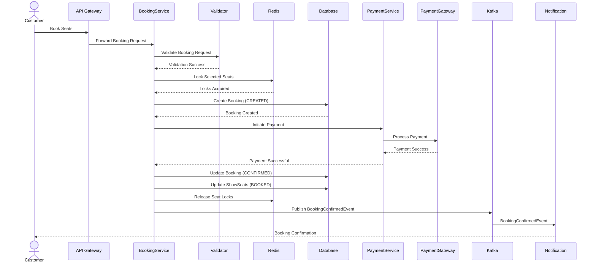

# Booking Engine - Sequence Diagram

**Version:** 1.0  
**Author:** Krushna Malode  
**Status:** Draft  
**Last Updated:** 2026-07-29

---

# 1. Overview

## 1.1 Purpose

This document describes the complete interaction flow of the Booking Engine within the Movie Booking Platform.

The sequence diagram illustrates how different services collaborate to process a booking request from the moment a customer selects seats until the booking is successfully confirmed or rejected.

It also documents the interaction between internal services, external services, Redis, Kafka, and the database while maintaining transactional consistency and preventing double booking.

This document serves as the architectural blueprint for implementing the Booking Engine.

---

# 2. Participants

The Booking Engine interacts with multiple internal and external components.

| Participant | Description |
|------------|-------------|
| Customer | Initiates the booking process by selecting seats and making payment. |
| API Gateway | Receives authenticated HTTP requests and routes them to Booking Service. |
| Booking Service | Coordinates the entire booking workflow. |
| Booking Validator | Validates all business rules before booking creation. |
| Seat Lock Service | Manages temporary seat reservations using Redis. |
| Redis | Stores temporary seat locks with expiration time. |
| Booking Database | Stores booking and booking seat information. |
| Payment Service | Initiates payment and receives payment callbacks. |
| Payment Gateway | External payment provider responsible for processing payments. |
| Kafka | Publishes domain events after booking completion. |
| Notification Service | Sends booking confirmation notifications to customers. |

---

# 3. Happy Path Workflow

The following steps describe the successful booking workflow.

---

## Step 1 – Customer Selects Seats

The customer browses available shows and selects one or more available seats.

Example:

- Movie : Avengers
- Theatre : PVR
- Show : 7:00 PM
- Seats : A5, A6

The customer then clicks **Book Now**.

---

## Step 2 – Request Reaches API Gateway

The booking request is sent to the API Gateway.

The API Gateway performs:

- Authentication validation
- JWT verification
- Request routing

The request is then forwarded to the Booking Service.

---

## Step 3 – Booking Validation

Booking Service invokes Booking Validator.

The Booking Validator verifies:

- User is authenticated.
- Show exists.
- Selected seats exist.
- Seats belong to the requested show.
- Seats are active.
- Seats are currently available.
- Booking request is valid.
- Seat count is greater than zero.

If any validation fails, the booking request is rejected.

---

## Step 4 – Acquire Seat Locks

Booking Service requests Seat Lock Service to temporarily reserve the selected seats.

Seat Lock Service stores temporary locks in Redis.

Redis Key Format

```
seat:{showId}:{seatId}
```

Example

```
seat:show123:seatA5
```

Each lock contains:

- Booking ID
- User ID
- Lock Timestamp
- Expiration Time

Lock TTL

```
300 Seconds (5 Minutes)
```

If Redis cannot acquire every requested lock, the booking request fails immediately.

---

## Step 5 – Create Booking

After successfully acquiring all seat locks, Booking Service creates a new Booking.

Initial Booking Status

```
CREATED
```

The database stores:

- Booking
- Booking Seats
- Booking Timestamp
- Booking Reference
- Customer ID

At this stage:

Seats are NOT booked.

They are only locked in Redis.

---

## Step 6 – Initiate Payment

Booking Service calls Payment Service.

Payment Service communicates with the external Payment Gateway.

Booking Status changes to

```
PAYMENT_PENDING
```

The customer is redirected to the payment interface.

---

## Step 7 – Payment Processing

The Payment Gateway processes the payment.

Possible outcomes:

- Payment Success
- Payment Failure
- Payment Timeout

For the Happy Path:

Payment succeeds.

Payment Gateway notifies Payment Service.

Payment Service sends confirmation to Booking Service.

---

## Step 8 – Confirm Booking

Booking Service updates the Booking.

Booking Status

```
CONFIRMED
```

Every corresponding ShowSeat changes from

```
AVAILABLE
```

to

```
BOOKED
```

Booking is now permanent.

---

## Step 9 – Release Redis Locks

Temporary seat locks are removed.

Redis deletes

```
seat:{showId}:{seatId}
```

for every booked seat.

Redis is no longer responsible for these seats.

The database now becomes the source of truth.

---

## Step 10 – Publish Domain Event

Booking Service publishes

```
BookingConfirmedEvent
```

Kafka receives the event.

Consumers may include:

- Notification Service
- Analytics Service
- Recommendation Service
- Audit Service

---

## Step 11 – Send Notification

Notification Service receives the event.

The customer receives:

- Booking Confirmation
- Booking Reference
- Seat Numbers
- Show Information

Booking workflow completes successfully.

---

# 4. Failure Flows

The Booking Engine must gracefully handle failures.

---

## Failure Scenario 1 – Seat Already Locked

Situation

Another customer has already locked one or more requested seats.

Workflow

Customer
↓

Booking Request
↓

Redis Lock Failed
↓

Booking Rejected
↓

HTTP 409 Conflict

No booking record is confirmed.

---

## Failure Scenario 2 – Validation Failure

Possible causes

- Show not found
- Seat not found
- Seat inactive
- Invalid request

Workflow

Booking Validator
↓

Validation Failed
↓

HTTP 400 Bad Request

No Redis lock is created.

---

## Failure Scenario 3 – Payment Failure

Workflow

Payment Failed
↓

Booking Status → FAILED
↓

Release Redis Locks
↓

Seats become AVAILABLE again

Customer may retry.

---

## Failure Scenario 4 – Payment Timeout

Workflow

Payment Pending
↓

Customer leaves page
↓

Booking Scheduler detects timeout
↓

Booking Status → EXPIRED
↓

Redis Locks Released
↓

Seats Available Again

---

## Failure Scenario 5 – Redis Unavailable

Workflow

Booking Request
↓

Redis Unreachable
↓

Booking Aborted
↓

HTTP 503 Service Unavailable

Booking creation does not continue.

---

## Failure Scenario 6 – Database Failure After Payment

Workflow

Payment Successful
↓

Database Update Failed
↓

Retry Confirmation
↓

Generate Alert
↓

Manual Recovery if required

This scenario will later be improved using Kafka retry mechanisms.

---

# 5. Timeout Flow

The Booking Engine automatically releases abandoned reservations.

Example Flow

Customer Selects Seats
↓

Seats Locked
↓

Customer Closes Browser
↓

5 Minutes Pass
↓

Booking Scheduler Executes
↓

Booking Expired
↓

Redis Locks Released
↓

Seats Become Available

No manual intervention is required.

---

# 6. Retry Flow

External payment providers may send duplicate callbacks.

Example

Callback #1

↓

Booking Confirmed

↓

Callback #2

↓

Ignored

The Booking Engine must implement idempotency to ensure duplicate callbacks do not produce duplicate booking confirmations.

---

# 7. Mermaid Sequence Diagram



---

# 8. Design Decisions

## DD-001

Bookings are created before payment so every payment is associated with a unique Booking Reference.

---

## DD-002

Seats are temporarily locked using Redis instead of immediately updating the database to improve concurrency and reduce database contention.

---

## DD-003

Payment processing occurs outside the database transaction to avoid long-running transactions.

---

## DD-004

Booking confirmation is performed only after successful payment.

---

## DD-005

Notifications are asynchronous and should never block booking confirmation.

---

## DD-006

Redis locks are always released after booking confirmation, booking failure, or booking expiration.

---

## DD-007

Kafka is used to publish booking events for asynchronous communication between microservices.

---

## DD-008

The Booking Database remains the single source of truth for confirmed bookings, while Redis is used only for temporary seat reservation.

---

# 9. Key Architectural Principles

The Booking Engine follows the following architectural principles:

- Single Responsibility Principle
- High Cohesion and Low Coupling
- Event-Driven Communication
- Eventual Consistency
- Idempotent Payment Processing
- Optimistic Concurrency Control
- Stateless Service Design
- Transaction Isolation
- Failure Recovery
- Horizontal Scalability

---

# 10. Summary

The sequence diagram establishes the complete execution flow of the Booking Engine.

It ensures that:

- Seats are never double-booked.
- Payment is processed safely.
- Temporary reservations expire automatically.
- Notifications are asynchronous.
- Booking confirmation occurs only after successful payment.
- The system remains scalable under high concurrency.
- Every interaction follows a predictable and recoverable workflow.

This document serves as the implementation blueprint for the Booking Engine and will guide the development of Booking Service, Seat Lock Service, Payment Service integration, Kafka event publishing, and booking state management.