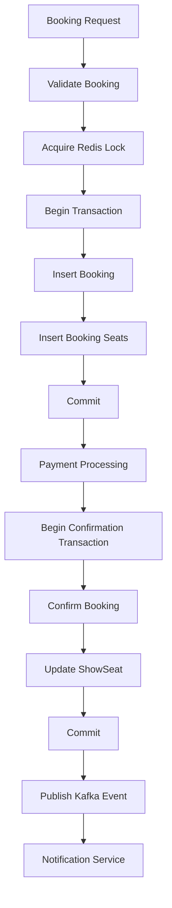

# Booking Engine - Transaction Boundaries

**Version:** 1.0  
**Author:** Krushna Malode  
**Status:** Draft  
**Last Updated:** 2026-07-29

---

# 1. Purpose

This document defines the transactional boundaries of the Booking Engine.

The Booking Engine is implemented using a microservices architecture where a single business operation spans multiple services. Since distributed transactions are avoided, each service maintains its own local transaction while coordinating with other services through asynchronous events and idempotent operations.

The objective of this document is to ensure data consistency, high performance, scalability, and recoverability without relying on distributed transactions.

---

# 2. Objectives

The transaction design aims to achieve the following objectives:

- Keep database transactions short.
- Avoid long-running database locks.
- Prevent deadlocks.
- Ensure booking consistency.
- Support asynchronous communication.
- Enable failure recovery.
- Improve throughput under high concurrency.
- Maintain database integrity.

---

# 3. Transaction Design Principles

The Booking Engine follows these principles:

- One business responsibility per transaction.
- Never wait for external systems inside a database transaction.
- Never call another microservice inside an open transaction.
- Commit local changes before publishing events.
- Every transaction must be idempotent whenever possible.
- Transactions should own only local database changes.
- Event publishing should occur after successful commit.
- Compensation should be used instead of distributed rollback.

---

# 4. Why Distributed Transactions Are Not Used

The Booking Platform consists of multiple independent services.

Examples:

- Booking Service
- Payment Service
- Notification Service
- Show Service

Each service owns its own database.

Because of this architecture:

- There is no shared database.
- Two-phase commit (2PC) is intentionally avoided.
- XA transactions are not used.
- Eventual consistency is preferred.

Reasons:

- Better scalability
- Better fault isolation
- Higher throughput
- Independent deployments
- Easier recovery

---

# 5. Transaction Lifecycle

The booking workflow is divided into multiple local transactions.

```
Booking Request

↓

Transaction 1
Validate Request
Acquire Seat Locks
Create Booking
Commit

↓

Payment Processing
(No Database Transaction)

↓

Transaction 2
Confirm Booking
Update Seats
Commit

↓

Publish Event

↓

Notification Service
```

Each transaction is independent.

---

# 6. Transaction 1 – Booking Creation

### Purpose

Create a temporary booking after validating the request.

### Operations

- Validate booking request
- Validate seat availability
- Acquire Redis seat locks
- Create Booking
- Create BookingSeat records

### Database Changes

Booking Table

BookingSeat Table

### Transaction Boundary

BEGIN

↓

Insert Booking

↓

Insert Booking Seats

↓

COMMIT

### Notes

Payment processing is NOT part of this transaction.

---

# 7. Transaction 2 – Booking Confirmation

### Trigger

Payment Service confirms successful payment.

### Operations

- Validate booking state
- Change Booking status
- Change ShowSeat status
- Update payment reference
- Record confirmation timestamp

### Database Changes

Booking

ShowSeat

Payment

### Transaction Boundary

BEGIN

↓

Update Booking

↓

Update ShowSeat

↓

Update Payment

↓

COMMIT

---

# 8. Transaction 3 – Booking Cancellation

### Trigger

Customer cancellation or business failure.

### Operations

- Update booking status
- Release seats
- Record cancellation reason

### Transaction

BEGIN

↓

Update Booking

↓

Update ShowSeat

↓

COMMIT

---

# 9. Transaction 4 – Booking Expiration

### Trigger

Scheduler detects expired booking.

### Operations

- Update booking status
- Release Redis locks
- Mark booking expired

### Transaction

BEGIN

↓

Update Booking

↓

COMMIT

Redis cleanup occurs immediately after commit.

---

# 10. What Must Never Be Inside a Transaction

The following operations must never execute while a database transaction is open.

❌ External HTTP Calls

Examples

- Payment Gateway
- Notification API
- SMS Provider

Reason

External systems are unpredictable and may take several seconds to respond.

---

❌ Kafka Publishing

Reason

Database commit must succeed before publishing events.

---

❌ Email Sending

Reason

Email failures must never roll back database transactions.

---

❌ File Uploads

Reason

File systems are outside database consistency guarantees.

---

❌ Long Computation

Reason

Long-running logic increases lock duration.

---

# 11. Redis and Transactions

Redis locking is not part of the relational database transaction.

Redis operations are performed before or after database transactions depending on the workflow.

Example

Acquire Lock

↓

Start Transaction

↓

Create Booking

↓

Commit

Redis lock remains independent.

---

# 12. Event Publishing

Booking events are published only after successful database commit.

Workflow

```
Transaction

↓

Commit

↓

BookingConfirmedEvent

↓

Kafka

↓

Consumers
```

This prevents publishing events for transactions that eventually roll back.

---

# 13. Failure Recovery

Scenario 1

Database commit fails.

Result

- Transaction rolls back.
- Redis locks are released.
- No event is published.

---

Scenario 2

Kafka unavailable.

Result

- Booking remains confirmed.
- Event is retried using the Outbox Pattern (future enhancement).

---

Scenario 3

Payment callback received twice.

Result

- Idempotency check prevents duplicate confirmation.

---

Scenario 4

Redis unavailable.

Result

- Booking transaction is not started.
- HTTP 503 returned.

---

# 14. Transaction Ownership

| Component | Starts Transaction | Commits Transaction |
|------------|-------------------|---------------------|
| BookingService | Yes | Yes |
| BookingValidator | No | No |
| SeatLockService | No | No |
| BookingStateMachine | No | No |
| BookingRepository | No | No |
| BookingEventPublisher | No | No |
| NotificationService | No | No |

BookingService is responsible for coordinating local transactions.

---

# 15. Spring Transaction Strategy

BookingService methods

- @Transactional
- Propagation.REQUIRED
- Rollback on RuntimeException

Read-only methods

- @Transactional(readOnly = true)

Scheduler methods

- Separate transaction per execution

Kafka listeners

- Independent transaction

Payment callback

- Independent transaction

---

# 16. Isolation Level

The Booking Engine uses the default database isolation level.

Recommended:

READ_COMMITTED

Reason

- Prevent dirty reads.
- Maintain high concurrency.
- Avoid unnecessary locking.

Optimistic locking using the @Version field in ShowSeat provides additional protection against concurrent updates.

---

# 17. Rollback Rules

Rollback occurs for:

- ValidationException
- BookingException
- PaymentVerificationException
- DatabaseException
- RuntimeException

No rollback for:

- Email failure
- Kafka retry failure
- Analytics failure

These operations execute after commit.

---

# 18. Transaction Flow Diagram



---

# 19. Design Decisions

## DD-001

Transactions remain local to each microservice.

---

## DD-002

External service calls never occur inside database transactions.

---

## DD-003

Booking confirmation is performed only after successful payment.

---

## DD-004

Redis is not transactionally coupled with the database.

---

## DD-005

Events are published only after successful commit.

---

## DD-006

Idempotency is mandatory for payment callbacks.

---

## DD-007

Optimistic locking protects concurrent seat updates.

---

## DD-008

Schedulers execute independent transactions.

---

# 20. Best Practices

- Keep transactions under one second whenever possible.
- Never block a transaction waiting for user interaction.
- Avoid nested transactions.
- Do not expose transaction management outside the service layer.
- Prefer optimistic locking over pessimistic locking.
- Publish events after commit.
- Use retries instead of distributed rollbacks.
- Log transaction failures with correlation IDs.
- Keep transaction scope as small as possible.

---


# 21. Summary

The Booking Engine follows a local transaction strategy suitable for microservices.

Key characteristics include:

- Short-lived transactions.
- Independent service ownership.
- Event-driven communication.
- Optimistic concurrency.
- No distributed transactions.
- High scalability.
- Failure recovery through retries and compensation.
- Strong consistency within each service.
- Eventual consistency across services.

These transaction boundaries ensure that the Booking Engine remains reliable, scalable, and maintainable under high-concurrency workloads while preserving data integrity.