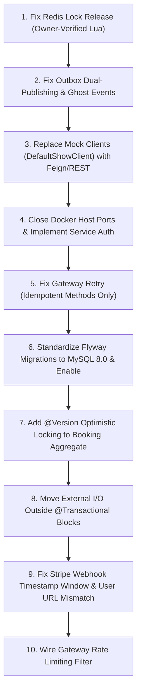

# Principal / Senior Backend Engineer Code Review: Movie Booking Platform

**Repository:** `krushna1845/VibeCheck`  
**Review Level:** Principal / Staff Backend Engineer  
**Scope:** Full Stack Microservices Architecture Audit (`auth-service`, `gateway-service`, `movie-service`, `theatre-service`, `show-service`, `booking-service`, `payment-service`, `notification-service`, `common`, Docker & Infrastructure)  
**Date of Audit:** 2026-08-29  
**Review Artifact:** `docs/final-senior-code-review.md`

---

## 1. Executive Summary

This audit is a comprehensive, production-readiness review of the Movie Booking Platform. The platform exhibits strong architectural intent, modern microservice structuring, and implements advanced design patterns including Redis distributed seat locking, Transactional Outbox with Kafka relay, idempotency tracking, HMAC signature verification, Resilience4j circuit breaking, and OpenPDF/ZXing ticket rendering.

However, a rigorous deep-dive into the concrete codebase reveals **critical vulnerabilities, concurrency race conditions, dual-publishing anomalies, fake inter-service clients, bypassable gateway security, and database dialect mismatches** that currently prevent this system from being production-safe. 

### Key High-Level Findings:
1. **Critical Concurrency & Double Booking Risk:** `RedisSeatLockServiceImpl.releaseLocks()` uses unconditional Redis key deletion (`DEL`) without validating lock ownership. Delayed expiration jobs or cancellations from User A can wipe active locks held by User B, allowing User C to lock the same seats simultaneously.
2. **Transactional Outbox Dual-Publishing & Ghost Events:** `KafkaBookingEventPublisher` writes to the Outbox table and immediately sends messages to Kafka asynchronously before the DB transaction commits. If the DB transaction rolls back, "ghost events" are published to Kafka; if it succeeds, events are published twice (immediately and via `OutboxRelayScheduler`).
3. **Simulated Inter-Service Calls:** `booking-service` relies on `DefaultShowClient` and `DefaultPaymentClient` containing in-memory `ConcurrentHashMap` mocks and hardcoded fake objects. Confirmed bookings never update the actual `show_seats` table in `show-service`.
4. **Security Perimeter Bypass:** In `docker-compose.yml`, all microservices expose their host ports (`8080`–`8086`), while downstream security configurations are set to `.anyRequest().permitAll()`. Any external client can bypass the API Gateway and execute administrative actions without authentication.
5. **Gateway Retry on Non-Idempotent Mutations:** API Gateway wraps all proxied HTTP calls (including `POST /api/v1/bookings` and `POST /api/v1/payments`) in Resilience4j `Retry`, leading to duplicate bookings and payments on socket timeouts.
6. **Database Migration Disconnect:** Flyway is disabled across all services (`flyway.enabled: false`) while Hibernate is set to `ddl-auto: update` against MySQL. The SQL migration scripts contain PostgreSQL-specific DDL (`TIMESTAMPTZ`, `gen_random_uuid()`, PL/pgSQL triggers, partial indexes) which will fail if executed on MySQL.

---

## 2. Categorized Architectural & Risk Identification

### A. Things That Are Genuinely Production-Grade
* **Distributed Redis Seat Lock Acquisition:** The Redis atomic `SETNX` implementation in `RedisSeatLockRepositoryImpl.saveIfAbsent` with strict TTL is well-structured for initial seat reservation.
* **Resilience & Idempotency Storage:** Dedicated `processed_events` tracking table and `PaymentIdempotencyService` caching architecture for duplicate webhook filtering.
* **Ticket Generation Engine:** OpenPDF + ZXing integration in `TicketServiceImpl` produces clean, self-contained PDF tickets with embedded QR codes and proper visual layouts.
* **Auditing and Domain Entity Design:** Entities consistently leverage JPA `@EntityListeners(AuditingEntityListener.class)` with `@CreatedDate` and `@LastModifiedDate`.
* **Central Correlation ID Propagation:** `CorrelationIdFilter` and MDC integration in Gateway and microservices establish unified tracing across log lines.

### B. Things That Only LOOK Production-Grade But Have Hidden Weaknesses
* **Transactional Outbox Pattern:** Outbox table exists, but `KafkaBookingEventPublisher` fires immediate asynchronous Kafka messages *inside* the active `@Transactional` boundary before commit, defeating the core guarantee of Outbox.
* **Outbox Relay Scheduler:** `OutboxRelayScheduler` lacks distributed locking (`FOR UPDATE SKIP LOCKED` or Redis lock). Multiple service replicas in Kubernetes/Docker will poll identical outbox batches simultaneously, flooding Kafka with duplicate messages.
* **Distributed Lock Release:** The Lua script `releaseLockScript` checks ownership, but the batch method `releaseLocks(showId, seatIds)` called during booking expiration, confirmation, and cancellation bypasses Lua and runs an unconditional `redis.delete()`.
* **Gateway Rate Limiter:** `GatewayRedisRepository` contains Redis rate limiting logic, but is dead code—it is never wired into Spring Security filter chains or request interceptors.
* **Payment Webhook Verification:** HMAC-SHA256 signature verification exists for Stripe and Razorpay, but Stripe signature verification ignores the header timestamp (`t=...`), exposing the system to webhook replay attacks.

### C. Things That Are Unnecessary Over-Engineering
* **Internal Self-Consumption of Kafka Events:** `booking-service` publishes `BookingCreatedEvent`, `BookingConfirmedEvent`, etc., and then defines `@KafkaListener` consumers in `BookingEventConsumer` to consume its own published events just to log them and mark them processed in `processed_events`.
* **Placeholder Kafka Consumers:** `auth-service`, `gateway-service`, and `common` define `@KafkaListener(topics = "default-topic")` with empty stub methods.
* **Dual Event Publishing in State Transitions:** `BookingServiceImpl` simultaneously publishes Kafka Domain Events AND triggers real-time WebSocket availability events across redundant channels for every single transition.

### D. Anything That Could Cause Data Corruption or Double Booking
* **Unconditional Seat Lock Deletion:** `ExpiredBookingProcessor` and `BookingServiceImpl.cancelBooking()` invoke `seatLockService.releaseLocks(showId, seatIds)`, deleting Redis keys regardless of whether another customer has acquired the lock after expiration.
* **Lack of `@Version` Optimistic Locking on `Booking`:** Concurrent webhook confirmations and expiration scheduler jobs can overwrite `CONFIRMED` state with `EXPIRED` (lost update problem).
* **Unordered Multi-Seat Acquisition Deadlocks:** `RedisSeatLockServiceImpl.lockSeats()` iterates over user-provided `seatIds` without sorting. Two users requesting overlapping seats in reverse order will mutually abort and roll back, degrading high-concurrency seat availability.
* **In-Memory Show Seat Updates:** `DefaultShowClient` updates an in-memory map inside `booking-service` instead of updating the database table `show_seats` in `show-service`.

### E. Anything That Could Cause Lost Kafka Events
* **Lack of Outbox Relay Poller Locking:** If `OutboxRelayScheduler` encounters an unexpected payload deserialization exception, `markAsFailed` increments retry count up to 5 without dead-letter routing for outbox tables, permanently stalling unparseable records.
* **Direct Kafka Publishing Exception Swallowing:** `KafkaBookingEventPublisher.sendEvent()` catches all exceptions and only logs them; if the Outbox Relay is disabled or fails, the event is silently lost.

### F. Anything That Could Cause Duplicate Payments
* **Gateway Automatic Retry on POST `/payments`:** When a payment initiation request times out on the socket, `ProxyController`'s Resilience4j `Retry` resends the HTTP POST to `payment-service`.
* **Idempotency Key Race in Payment Initiation:** `PaymentServiceImpl.initiatePayment()` checks the cache, then persists to DB. Two concurrent requests with the same idempotency key arriving simultaneously will both pass the cache check before the first record is saved, triggering duplicate calls to upstream payment providers.

### G. Anything That Could Leak Credentials or Personal Data
* **Hardcoded JWT Secret Fallbacks:** `JwtValidator` and `JwtTokenProvider` have default fallback secrets: `9a4f2c8d7e6b5a4c3f2e1d0c9b8a7f6e5d4c3b2a1f0e9d8c7b6a5f4e3d2c1b0a`.
* **Unrestricted Docker Port Exposure:** Microservices running with `.anyRequest().permitAll()` expose ports `8080-8086` directly on `0.0.0.0`, allowing unauthenticated access to user records, bookings, and payment histories.
* **Missing Header Sanitization at Gateway:** API Gateway copies all inbound request headers directly to downstream services. A malicious user can send `X-User-Id` and `X-User-Roles: ROLE_ADMIN` to spoof identity on unauthenticated routes.

---

## 3. Critical Findings (Severity: CRITICAL)

### [CRIT-01] Unconditional Redis Lock Deletion Causes Race Conditions and Double Bookings
* **Severity:** CRITICAL
* **Blocking Production:** YES
* **File:** `booking-service/src/main/java/com/krushna/moviebooking/booking/service/impl/RedisSeatLockServiceImpl.java`
* **Class/Method:** `RedisSeatLockServiceImpl.releaseLocks(UUID showId, List<UUID> seatIds)`
* **Problem:**
  The `releaseLocks` method unconditionally calls `seatLockRepository.delete(showId, seatId)`, which issues a raw Redis `DEL`. It completely ignores ownership tokens or user IDs.
  ```java
  @Override
  public void releaseLocks(UUID showId, List<UUID> seatIds) {
      for (UUID seatId : seatIds) {
          seatLockRepository.delete(showId, seatId); // RAW UNCONDITIONAL DEL
      }
  }
  ```
* **Why it matters in production:**
  If User A's booking expires at $T$, User B immediately locks the seat at $T+10ms$. When User A's background expiration job (`ExpiredBookingProcessor`) runs at $T+50ms$, it unconditionally deletes the Redis key for the seat. User C can then immediately lock the exact same seat. Both User B and User C will believe they own the lock and proceed to payment, causing a **double booking**.
* **Recommended Fix:**
  Replace unconditional `delete` with owner-verified deletion via Lua script across all flows:
  `seatLockRepository.deleteIfOwnedBy(showId, seatId, userId.toString())`.

---

### [CRIT-02] Outbox Dual-Publishing & Ghost Event Transmission Before DB Commit
* **Severity:** CRITICAL
* **Blocking Production:** YES
* **File:** `booking-service/src/main/java/com/krushna/moviebooking/booking/event/KafkaBookingEventPublisher.java`
* **Class/Method:** `KafkaBookingEventPublisher.publishBookingCreated(...)` (and all other publish methods)
* **Problem:**
  Inside the publisher, the service saves the event to the outbox table and *immediately* sends it over the network to Kafka via `sendEvent()`:
  ```java
  @Override
  public void publishBookingCreated(BookingCreatedEvent event) {
      outboxEventService.saveEvent("Booking", event.bookingReference(), event.eventType(), event.eventVersion(), event);
      sendEvent(KafkaConfig.BOOKING_CREATED_TOPIC, event.bookingReference(), event.eventId(), event.eventType(), event);
  }
  ```
* **Why it matters in production:**
  1. **Ghost Events:** `BookingServiceImpl.createBooking()` is `@Transactional`. `sendEvent` sends to Kafka *before* the transaction commits. If the database transaction fails to commit (e.g., deadlock, serialization error, database outage), the Kafka message is already delivered. Downstream services (e.g., payment, notifications) will act on a booking that does not exist in the database.
  2. **Duplicate Events:** If the transaction succeeds, the outbox record remains in `PENDING` state because `sendEvent` does not mark it as `PUBLISHED`. The `OutboxRelayScheduler` will subsequently poll this pending record 5 seconds later and publish the message a second time.
* **Recommended Fix:**
  Do not invoke `sendEvent()` directly in `KafkaBookingEventPublisher`. Let `OutboxRelayScheduler` handle 100% of the Kafka publishing asynchronously, OR publish using Spring `@TransactionalEventListener(phase = TransactionPhase.AFTER_COMMIT)`.

---

### [CRIT-03] Mock Inter-Service Clients in Booking Service (`DefaultShowClient`)
* **Severity:** CRITICAL
* **Blocking Production:** YES
* **File:** `booking-service/src/main/java/com/krushna/moviebooking/booking/client/DefaultShowClient.java`
* **Class/Method:** Entire Class (`getShowSeatsByIds`, `updateShowSeatsStatus`, `existsShow`)
* **Problem:**
  `booking-service` does not make real network calls (HTTP/Feign/RestClient) to `show-service`. It maintains a private, in-memory `ConcurrentHashMap<UUID, List<ShowSeatDto>> showSeatCatalog` with mocked seat prices (`250.00`) and dummy show data.
  ```java
  @Override
  public void updateShowSeatsStatus(UUID showId, List<UUID> showSeatIds, String status) {
      // Modifies an in-memory Map only. Never calls show-service!
      List<ShowSeatDto> current = showSeatCatalog.getOrDefault(showId, new ArrayList<>());
      ...
  }
  ```
* **Why it matters in production:**
  When a booking is confirmed, cancelled, or expired, the actual database in `show-service` (`show_seats` table) is **never updated**. Show catalog queries from other users will continue to show seats in their initial state.
* **Recommended Fix:**
  Replace `DefaultShowClient` with a real Spring Cloud OpenFeign client or `RestClient` calling `http://show-service:8083/api/v1/shows/...` with proper timeout and circuit breaker configurations.

---

### [CRIT-04] Complete Perimeter Bypass: Exposed Service Ports with `permitAll()`
* **Severity:** CRITICAL
* **Blocking Production:** YES
* **Files:**
  - `docker-compose.yml` (Lines 135, 168, 205, 242, 279, 316, 360)
  - `booking-service/src/main/java/com/krushna/moviebooking/booking/config/SecurityConfig.java` (Line 21)
  - `movie-service/src/main/java/com/krushna/moviebooking/movie/config/SecurityConfig.java` (Line 25)
  - `theatre-service/src/main/java/com/krushna/moviebooking/theatre/config/SecurityConfig.java` (Line 21)
  - `show-service/src/main/java/com/krushna/moviebooking/show/config/SecurityConfig.java` (Line 21)
* **Problem:**
  In `docker-compose.yml`, every downstream service binds its internal port directly to host ports `8080:8080`, `8081:8081`, `8082:8082`, `8083:8083`, `8084:8084`, `8085:8085`, `8086:8086`. Downstream services configure their security filter chains as `.anyRequest().permitAll()`.
* **Why it matters in production:**
  Any unauthenticated client can bypass API Gateway entirely by making direct requests to `http://<host>:8084/api/v1/bookings`, `http://<host>:8085/api/v1/payments`, or `http://<host>:8081/api/v1/movies`. Attackers can create bookings, trigger refunds, or delete movie catalog entries with zero authentication.
* **Recommended Fix:**
  1. Remove host port bindings for internal services in `docker-compose.yml` (only expose `8079` for API Gateway).
  2. Implement mutual TLS (mTLS) or shared internal HMAC/JWT token validation in downstream services.

---

### [CRIT-05] Gateway Retrying Non-Idempotent Mutations (POST/PUT/PATCH)
* **Severity:** CRITICAL
* **Blocking Production:** YES
* **File:** `gateway-service/src/main/java/com/krushna/moviebooking/gateway/controller/ProxyController.java`
* **Class/Method:** `ProxyController.proxyRequest(...)` (Lines 120–127)
* **Problem:**
  The gateway applies Resilience4j `Retry` globally across all proxied endpoints, regardless of HTTP method:
  ```java
  Callable<ResponseEntity<byte[]>> decoratedCall = CircuitBreaker.decorateCallable(circuitBreaker,
          Retry.decorateCallable(retry, () -> {
              HttpEntity<byte[]> entity = new HttpEntity<>(body, headers);
              return restTemplate.exchange(URI.create(targetUrl), method, entity, byte[].class);
          }));
  ```
* **Why it matters in production:**
  If a client submits `POST /api/v1/bookings` or `POST /api/v1/payments/initiate` and downstream processing takes longer than the read timeout, the gateway will automatically retry the request. This causes duplicate booking creations, double seat lock acquisition attempts, or multiple payment intent creations.
* **Recommended Fix:**
  Restrict Retry to idempotent HTTP methods (`GET`, `HEAD`, `OPTIONS`, `PUT` where idempotent). Never retry `POST` or `PATCH` requests at the gateway level.

---

### [CRIT-06] Broken Flyway Migrations & Dialect Mismatch (Postgres SQL on MySQL Engine)
* **Severity:** CRITICAL
* **Blocking Production:** YES
* **Files:**
  - `booking-service/src/main/resources/application.yml` (Line 25)
  - `booking-service/src/main/resources/db/migration/V6__create_outbox_and_processed_events.sql`
  - `payment-service/src/main/resources/db/migration/V6__create_payments.sql`
* **Problem:**
  Flyway is disabled across the platform (`flyway.enabled: false`) while Hibernate is set to `ddl-auto: update` against MySQL 8.0. The SQL migration scripts in `db/migration/` contain PostgreSQL-specific constructs:
  - `gen_random_uuid()`
  - `TIMESTAMPTZ`
  - `CREATE OR REPLACE FUNCTION ... LANGUAGE plpgsql;`
  - Partial indexes: `CREATE INDEX ... WHERE status = 'PENDING';`
* **Why it matters in production:**
  1. If Flyway is enabled in production, every microservice will immediately fail to boot due to syntax errors on MySQL.
  2. Relying on Hibernate `ddl-auto: update` in production leads to missing partial indexes, missing foreign key constraints, unmanaged schema drifts, and inability to perform zero-downtime database rollbacks.
* **Recommended Fix:**
  Standardize all Flyway scripts to standard MySQL 8.0 syntax (`VARCHAR(36)` / `BINARY(16)` for UUIDs, `DATETIME(6)` for timestamps, standard composite indexes) and re-enable Flyway (`flyway.enabled: true`) with `ddl-auto: validate`.

---

## 4. High Priority Findings (Severity: HIGH)

### [HIGH-01] Missing Optimistic Locking (`@Version`) on Booking Aggregate
* **Severity:** HIGH
* **Blocking Production:** YES
* **File:** `booking-service/src/main/java/com/krushna/moviebooking/booking/entity/Booking.java`
* **Class/Method:** `Booking` Entity
* **Problem:**
  `Booking` entity lacks a `@Version` field. Status transitions in `BookingServiceImpl` (e.g., `confirmBooking`, `cancelBooking`, `expireBooking`) read the entity, modify status in memory, and save without version checks or pessimistic database locks (`SELECT FOR UPDATE`).
* **Why it matters in production:**
  Lost updates occur under race conditions. If a customer payment succeeds at the exact same moment the reservation timeout scheduler triggers, the scheduler can read the booking in `PENDING` status, change it to `EXPIRED`, and commit *after* the payment confirmation committed, overwriting `CONFIRMED` with `EXPIRED`.
* **Recommended Fix:**
  Add `@Version private Long version;` to `Booking.java` and handle `OptimisticLockingFailureException` with appropriate retries.

---

### [HIGH-02] Outbox Relay Poller Lacks Distributed Locking & Multi-Instance Safety
* **Severity:** HIGH
* **Blocking Production:** YES
* **File:** `booking-service/src/main/java/com/krushna/moviebooking/booking/outbox/OutboxRelayScheduler.java`
* **Class/Method:** `OutboxRelayScheduler.processOutboxEvents()`
* **Problem:**
  The relay poller uses an in-memory `AtomicBoolean isRunning` to prevent concurrent execution on a single JVM instance. However, it does not use ShedLock, Redis distributed locks, or SQL row-level locks (`SELECT ... FOR UPDATE SKIP LOCKED`).
* **Why it matters in production:**
  In a clustered deployment with multiple replicas of `booking-service`, all instances will query the same top 50 pending records simultaneously at 5-second intervals, publishing duplicate events to Kafka for every pending record.
* **Recommended Fix:**
  Implement ShedLock (`@SchedulerLock`) or execute database queries with `SELECT * FROM outbox_events WHERE status = 'PENDING' FOR UPDATE SKIP LOCKED`.

---

### [HIGH-03] Hardcoded Default JWT Secret in Gateway and Auth Service
* **Severity:** HIGH
* **Blocking Production:** YES
* **Files:**
  - `gateway-service/src/main/java/com/krushna/moviebooking/gateway/security/JwtValidator.java` (Line 27)
  - `auth-service/src/main/java/com/krushna/moviebooking/auth/security/JwtTokenProvider.java` (Line 29)
* **Problem:**
  Both services fall back to a hardcoded default secret if the `jwt.secret` property is not provided:
  `9a4f2c8d7e6b5a4c3f2e1d0c9b8a7f6e5d4c3b2a1f0e9d8c7b6a5f4e3d2c1b0a`
* **Why it matters in production:**
  If an administrator fails to define `JWT_SECRET` in production environment variables, attackers can forge valid JWT tokens containing `ROLE_ADMIN` and arbitrary user IDs to compromise the system.
* **Recommended Fix:**
  Remove default values. Fail application startup (`@PostConstruct` or Spring validation) if `jwt.secret` is missing or shorter than 256 bits.

---

### [HIGH-04] Stripe Webhook Missing Timestamp Verification (Replay Attack Vulnerability)
* **Severity:** HIGH
* **Blocking Production:** YES
* **File:** `payment-service/src/main/java/com/krushna/moviebooking/payment/gateway/StripePaymentClient.java`
* **Class/Method:** `StripePaymentClient.verifyWebhookSignature(...)` (Lines 83–110)
* **Problem:**
  The webhook validator extracts `t=timestamp` and verifies the HMAC hash, but never checks if `Instant.now().getEpochSecond() - timestamp` exceeds the tolerance window (e.g., 300 seconds).
* **Why it matters in production:**
  An attacker who intercepts a valid historical Stripe webhook can replay it at any future point, repeatedly triggering state machine transitions or webhook callbacks.
* **Recommended Fix:**
  Add timestamp tolerance validation:
  ```java
  long webhookTime = Long.parseLong(timestamp);
  if (Math.abs(Instant.now().getEpochSecond() - webhookTime) > 300) {
      log.warn("Stripe webhook timestamp out of tolerance window: {}", webhookTime);
      return false;
  }
  ```

---

### [HIGH-05] Gateway Rate Limiter Is Dead Code
* **Severity:** HIGH
* **Blocking Production:** NO
* **File:** `gateway-service/src/main/java/com/krushna/moviebooking/gateway/redis/GatewayRedisRepository.java`
* **Class/Method:** Entire Class
* **Problem:**
  `GatewayRedisRepository` implements Redis rate limiting logic, but is never injected or invoked anywhere in `SecurityConfig`, `ProxyController`, or any filter in `gateway-service`.
* **Why it matters in production:**
  The gateway operates with zero rate limiting. The platform is vulnerable to volumetric DoS attacks, brute force login attempts, and seat-locking script abuse.
* **Recommended Fix:**
  Create a `RateLimitingFilter` extending `OncePerRequestFilter`, wire it before `ProxyController`, and return HTTP 429 Too Many Requests when limits are exceeded.

---

### [HIGH-06] Heavy External I/O Executed Inside `@Transactional` Database Boundaries
* **Severity:** HIGH
* **Blocking Production:** NO
* **Files:**
  - `payment-service/src/main/java/com/krushna/moviebooking/payment/service/impl/PaymentServiceImpl.java` (Line 54)
  - `notification-service/src/main/java/com/krushna/moviebooking/notification/service/NotificationServiceImpl.java` (Line 65)
  - `booking-service/src/main/java/com/krushna/moviebooking/booking/service/impl/BookingServiceImpl.java` (Line 79)
* **Problem:**
  - `PaymentServiceImpl.initiatePayment()` executes external payment gateway REST calls (`client.initiatePayment()`) inside `@Transactional`.
  - `NotificationServiceImpl.sendNotification()` executes user profile REST lookups, PDF generation, QR rendering, and SMTP mail dispatch inside `@Transactional`.
* **Why it matters in production:**
  Database connections from HikariCP are held open during high-latency external network I/O. Under load, connection pool exhaustion occurs within seconds, cascading into systemic 500 errors across all services.
* **Recommended Fix:**
  Split workflows into non-transactional orchestration layers and small, discrete `@Transactional` database persistence methods.

---

### [HIGH-07] User Profile Endpoint URL Mismatch in Notification Service
* **Severity:** HIGH
* **Blocking Production:** NO
* **Files:**
  - `notification-service/src/main/java/com/krushna/moviebooking/notification/client/UserServiceClient.java` (Line 33)
  - `auth-service/src/main/java/com/krushna/moviebooking/auth/controller/AuthController.java` (Line 87)
* **Problem:**
  `UserServiceClient` in `notification-service` requests `GET /api/v1/users/{userId}`. However, `auth-service` exposes the endpoint at `GET /api/v1/auth/user/{id}`.
* **Why it matters in production:**
  Every call to `UserServiceClient` results in an HTTP 404. `notification-service` silently falls back to dummy emails (`<userId>@placeholder.vibecheck.com`). No real user ever receives booking confirmation emails or tickets in production.
* **Recommended Fix:**
  Update `UserServiceClient` URL to match `auth-service`:
  `String url = properties.userService().baseUrl() + "/api/v1/auth/user/" + userId;`

---

## 5. Medium & Low Priority Findings

### [MED-01] Unsorted Multi-Seat Lock Acquisition Deadlock Collisions
* **Severity:** MEDIUM
* **File:** `booking-service/src/main/java/com/krushna/moviebooking/booking/service/impl/RedisSeatLockServiceImpl.java` (Line 64)
* **Problem:**
  `lockSeats` locks seats sequentially in the order provided in `request.seatIds()`. If User 1 requests `[SeatA, SeatB]` and User 2 requests `[SeatB, SeatA]`, User 1 acquires `SeatA` while User 2 acquires `SeatB`. Both then fail to acquire their second seat and roll back.
* **Fix:** Sort `seatIds` naturally before acquiring Redis locks (`seatIds.stream().sorted().toList()`).

### [MED-02] Flawed Lua Script Substring Matching for Lock Ownership
* **Severity:** MEDIUM
* **File:** `booking-service/src/main/java/com/krushna/moviebooking/booking/config/RedisConfig.java` (Line 33)
* **Problem:**
  Lua script uses `string.find(val, ARGV[1], 1, true)` on a JSON string. If a token or user ID happens to be a substring of another field, ownership validation will produce false positives.
* **Fix:** Use JSON parsing in Redis Lua (`cjson.decode(val)`) or store a simple token string as the value.

### [MED-03] Overly Permissive CORS Configuration
* **Severity:** MEDIUM
* **File:** `gateway-service/src/main/java/com/krushna/moviebooking/gateway/security/SecurityConfig.java` (Lines 62–67)
* **Problem:**
  `config.setAllowedOriginPatterns(List.of("*"))` is combined with `config.setAllowCredentials(true)`, allowing any domain to perform authenticated cross-origin requests.
* **Fix:** Restrict allowed origins to trusted production domains specified via configuration.

### [MED-04] Fake Payment Client Implementations in Payment Service
* **Severity:** MEDIUM
* **Files:**
  - `payment-service/src/main/java/com/krushna/moviebooking/payment/gateway/RazorpayPaymentClient.java`
  - `payment-service/src/main/java/com/krushna/moviebooking/payment/gateway/StripePaymentClient.java`
* **Problem:**
  `RazorpayPaymentClient` and `StripePaymentClient` generate random mock IDs (`order_...` and `cs_test_...`) and do not invoke actual Stripe/Razorpay SDKs or HTTP APIs.
* **Fix:** Integrate real Stripe Java SDK (`com.stripe:stripe-java`) and Razorpay Java Client (`com.razorpay:razorpay-java`).

### [LOW-01] Dead Kafka Consumers in Non-Messaging Services
* **Severity:** LOW
* **Files:**
  - `auth-service/src/main/java/com/krushna/moviebooking/auth/kafka/consumer/AuthEventConsumer.java`
  - `gateway-service/src/main/java/com/krushna/moviebooking/gateway/kafka/consumer/GatewayEventConsumer.java`
* **Problem:**
  Scaffolded classes subscribe to `"default-topic"` with empty handler bodies, creating unnecessary Kafka consumer groups.
* **Fix:** Delete unused consumer classes and dependencies.

### [LOW-02] Plaintext Secrets in Docker Compose
* **Severity:** LOW
* **File:** `docker-compose.yml`
* **Problem:**
  Root database passwords and environment variables are referenced without Docker secrets or vault integration.
* **Fix:** Use Docker Secrets or external secret managers (AWS Secrets Manager, HashiCorp Vault).

---

## 6. Comprehensive Dimension Assessments

### 6.1 Architecture & Bounded Contexts
* **Strengths:** Microservice domain boundaries (Movie, Theatre, Show, Booking, Payment, Notification, Auth) are logically well-divided.
* **Weaknesses:** Inter-service communication is simulated via in-memory mocks (`DefaultShowClient`, `DefaultPaymentClient`) instead of real REST/Feign integration, breaking runtime microservice autonomy.

### 6.2 Security Assessment
* **Strengths:** BCrypt password hashing in `auth-service`, HMAC-SHA256 signature verification utilities, JWT claims parsing with role extraction.
* **Weaknesses:** Downstream services permit all requests while exposing direct host ports. Gateway passes client-supplied headers without sanitization. Hardcoded fallback JWT secrets exist.

### 6.3 Concurrency & Distributed Locking
* **Strengths:** Redis atomic `SETNX` prevents duplicate simultaneous seat lock acquisition.
* **Weaknesses:** Unconditional lock deletion (`DEL`) allows stale cleanups to wipe newly acquired locks. Lack of `@Version` on `Booking` aggregate allows lost updates between webhooks and expiration timers.

### 6.4 Messaging & Transactional Outbox
* **Strengths:** Outbox event table, processed events table for consumer idempotency, Dead Letter Topic (DLT) routing.
* **Weaknesses:** Publisher sends messages to Kafka *before* database commit (ghost event risk) and fails to mark outbox records as published (duplicate event risk). Outbox scheduler lacks multi-instance clustering locks.

### 6.5 Database & Persistence
* **Strengths:** Consistent JPA entity auditing and relationship mappings (`@ManyToOne(fetch = FetchType.LAZY)`).
* **Weaknesses:** Flyway is disabled; migration scripts use Postgres syntax while the runtime database is MySQL; schema generation relies on Hibernate `ddl-auto: update`.

### 6.6 Testing & Verification
* **Strengths:** Good unit test coverage with Mockito across services; concurrency tests utilize Testcontainers for Redis.
* **Weaknesses:** Concurrency tests only test single-seat acquisition and mock-based clients. End-to-end integration tests do not test real multi-service network communication between `booking-service` and `show-service`.

### 6.7 Performance & Reliability
* **Strengths:** Redis caching on show catalog endpoints; HikariCP connection pooling configured.
* **Weaknesses:** Heavy network and PDF rendering operations are executed inside `@Transactional` blocks, creating critical database connection pool bottlenecks.

---

## 7. Final Risk Rating

| Assessment Category | Risk Level | Status |
| :--- | :--- | :--- |
| **Concurrency & Distributed Locking** | **CRITICAL** | 🔴 Double-booking race conditions present |
| **Data Integrity & Outbox** | **CRITICAL** | 🔴 Ghost Kafka events on TX rollback |
| **Service Integration** | **CRITICAL** | 🔴 In-memory mock clients used in production code |
| **Network & API Security** | **CRITICAL** | 🔴 Direct port exposure with `permitAll()` |
| **Database & Migrations** | **HIGH** | 🟠 Postgres/MySQL dialect collision; Flyway disabled |
| **Resilience & Fault Tolerance** | **HIGH** | 🟠 Gateway retrying non-idempotent mutations |
| **Observability & Logging** | **LOW** | 🟢 Prometheus, Micrometer, Correlation IDs active |

### OVERALL PRODUCTION READINESS RATING: **NOT PRODUCTION READY (BLOCKED)**

---

## 8. Recommended Fix Order



1. **Step 1:** Modify `RedisSeatLockServiceImpl.releaseLocks` to use `deleteIfOwnedBy` Lua script.
2. **Step 2:** Remove `sendEvent()` from `KafkaBookingEventPublisher`; let `OutboxRelayScheduler` handle Kafka delivery post-commit.
3. **Step 3:** Implement real Feign/RestClient in `booking-service` to call `show-service` and update actual `show_seats`.
4. **Step 4:** Remove host port bindings `8080-8086` from `docker-compose.yml`; restrict all ingress to Gateway `8079`.
5. **Step 5:** Modify `ProxyController` to apply Resilience4j `Retry` only on `GET` requests.
6. **Step 6:** Rewrite SQL migrations for MySQL 8.0 syntax, enable Flyway (`flyway.enabled: true`), and set `ddl-auto: validate`.
7. **Step 7:** Add `@Version` to `Booking` entity to prevent concurrent state overwrites.
8. **Step 8:** Move payment gateway HTTP calls, email sending, and PDF ticket generation outside `@Transactional` methods.
9. **Step 9:** Add timestamp expiration check in `StripePaymentClient` and fix user URL in `notification-service`.
10. **Step 10:** Wire `GatewayRedisRepository` into a `RateLimitingFilter` at the Gateway.
