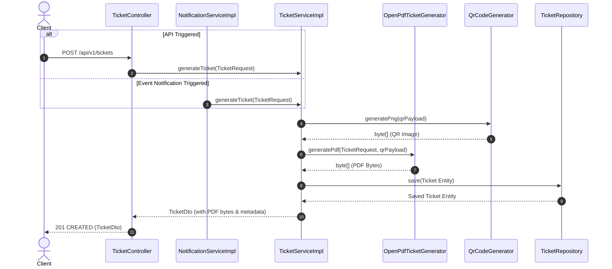

# Ticket Generation Service - Technical Documentation (Milestone 3)

## Overview

The `TicketService` is responsible for generating production-ready PDF booking tickets, creating and embedding dynamic ZXing QR codes, storing ticket metadata in MySQL/PostgreSQL databases, and integrating seamlessly with `NotificationService` for customer email delivery.

---

## Key Features & Requirements Met

1. **PDF Generation**: Powered by **OpenPDF** (`com.github.librepdf:openpdf`), an open-source, lightweight Java PDF engine.
2. **Embedded QR Code**: Generated via **ZXing** (`com.google.zxing:core`, `javase`) as a PNG image and embedded cleanly inside the PDF ticket.
3. **Comprehensive Ticket Attributes Included**:
   - **Movie Title**
   - **Theatre Name**
   - **Screen Name**
   - **Seat Numbers**
   - **Booking ID**
   - **Booking Reference**
   - **Show Date**
   - **Show Time**
   - **Total Amount Paid**
4. **Metadata Storage**: Persists generated tickets in the `tickets` database table with JPA auditing (`created_at`, `updated_at`) and status management.
5. **Notification Integration**: Automatically triggers ticket PDF generation and attaches the document when sending `BOOKING_CONFIRMED` notifications.
6. **REST API**: Offers endpoints to generate tickets, fetch ticket metadata, and download raw PDF bytes.

---

## Architecture & Data Flow



---

## Database Schema (`tickets` Table)

Flyway script: `V8__create_tickets.sql`

| Column | Type | Constraints | Description |
|---|---|---|---|
| `id` | UUID | PRIMARY KEY | Unique ticket identifier |
| `ticket_number` | VARCHAR(50) | NOT NULL, UNIQUE | Human-readable ticket number (e.g. `TKT-A1B2C3D4`) |
| `booking_id` | UUID | NOT NULL, INDEX | Foreign reference to booking |
| `booking_reference` | VARCHAR(50) | NOT NULL, INDEX | External booking reference code |
| `user_id` | UUID | NULLABLE | User ID owning booking |
| `movie_title` | VARCHAR(255) | NOT NULL | Movie title |
| `theatre_name` | VARCHAR(255) | NOT NULL | Theatre / Cinema hall name |
| `screen_name` | VARCHAR(100) | NOT NULL | Screen name / number |
| `seat_numbers` | VARCHAR(255) | NOT NULL | Comma-separated seat identifiers |
| `show_date` | DATE | NULLABLE | Date of show |
| `show_time` | TIME | NULLABLE | Start time of show |
| `amount` | DECIMAL(10,2) | NOT NULL | Ticket cost |
| `qr_code_data` | TEXT | NOT NULL | Encoded payload embedded in QR |
| `status` | VARCHAR(20) | NOT NULL | Enum (`GENERATED`, `SENT`, `CANCELLED`, `VERIFIED`) |
| `created_at` | TIMESTAMP | NOT NULL | Record creation timestamp |
| `updated_at` | TIMESTAMP | NOT NULL | Last update timestamp |

---

## API Specification

### 1. Generate Ticket
- **Method**: `POST`
- **Path**: `/api/v1/tickets`
- **Request Body**:
```json
{
  "bookingId": "a1b2c3d4-e5f6-7890-abcd-ef1234567890",
  "bookingReference": "VIBE-889900",
  "movieTitle": "Inception",
  "theatreName": "PVR Forum Mall",
  "screenName": "Screen 2",
  "seatNumbers": "E10, E11",
  "showDate": "2026-08-15",
  "showTime": "19:30:00",
  "amount": 500.00
}
```
- **Response**: `201 CREATED` with `TicketDto`.

---

### 2. Fetch Ticket Metadata by Booking ID
- **Method**: `GET`
- **Path**: `/api/v1/tickets/booking/{bookingId}`
- **Response**: `200 OK` with `TicketDto`.

---

### 3. Fetch Ticket Metadata by Booking Reference
- **Method**: `GET`
- **Path**: `/api/v1/tickets/reference/{bookingReference}`
- **Response**: `200 OK` with `TicketDto`.

---

### 4. Download Ticket PDF Document
- **Method**: `GET`
- **Path**: `/api/v1/tickets/reference/{bookingReference}/pdf`
- **Response**: `200 OK` with `Content-Type: application/pdf` binary stream.

---

## Verification & Testing

Unit tests implemented:
- `OpenPdfTicketGeneratorTest`: Validates OpenPDF PDF generation, stream headers, and QR inclusion.
- `TicketServiceImplTest`: Validates service workflow, repository calls, and metrics counter incrementing.
- `TicketControllerTest`: Validates REST endpoints and HTTP status mapping.
- `NotificationServiceImplTest`: Validates notification-to-ticket service orchestration.
