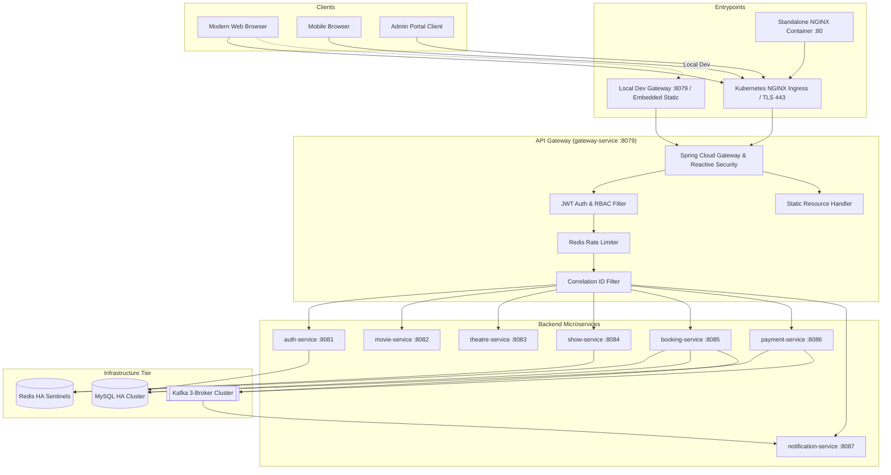

# Milestone 33 — Environment Configuration & Deployment Topology
**VibeCheck Movie Booking Platform — Production E2E Hardening**

---

## 1. Overview & Architectural Strategy

The VibeCheck application frontend is designed with a **12-factor application topology** supporting multiple deployment targets without requiring codebase modifications or hardcoded endpoints.

The architecture decouples the static presentation tier from the dynamic microservice ecosystem via **Spring Cloud Gateway** (`gateway-service`, port `8079` locally / port `80` & `443` via Kubernetes Ingress).



---

## 2. Environment Configuration Matrix

The frontend runtime environment resolution operates via a deterministic hierarchy implemented in `web/js/config.js`:

```javascript
// Dynamic Base URL Resolution Hierarchy:
// 1. window.__ENV__.VIBECHECK_API_URL (Injected via Kubernetes ConfigMap or script tag)
// 2. localStorage.getItem('VIBECHECK_GATEWAY_URL') (Developer override in DevTools)
// 3. Current origin (if hosted on non-file origin e.g. Ingress or Gateway)
// 4. Fallback default: 'http://localhost:8079'
```

| Deployment Tier | Frontend Host Mode | Base API URL | Auth / CORS Model | Ingress / Path Routing | Static Asset Caching |
| :--- | :--- | :--- | :--- | :--- | :--- |
| **Local Standalone** (`file://` or LiveServer `5500`) | Standalone HTML files | `http://localhost:8079` | CORS enabled on Gateway (`allowedOrigins: *` or `localhost:[*]`) | None (Direct Gateway HTTP) | No caching (`Cache-Control: no-store`) |
| **Local Integrated** (Embedded in Gateway `8079`) | Served by `gateway-service` (`/static/**`) | Same origin (`/`) | Same-Origin (no CORS preflight required) | Gateway route `/` -> `classpath:/static/` | Browser Cache / ETag enabled |
| **Local Docker Compose** | Nginx Alpine container (`web:80`) + Compose Gateway | `http://localhost:8079` or `/api` via Nginx reverse proxy | Docker internal DNS / Proxy | Nginx proxies `/api/` to `gateway-service:8079` | Static files cached 1hr |
| **Minikube / Kubernetes Staging** | Served via Gateway or Nginx Pod | Relative `/` (Ingress routes `/api/**` to Gateway) | Same-Domain cookie or Bearer header; Ingress handles routing | Ingress rule: `host: vibecheck.local` | Ingress caching & Gzip enabled |
| **Production Kubernetes (AWS EKS / GKE)** | Nginx Edge / CDN + Ingress Controller | Ingress Domain: `https://vibecheck.io` | Strict CORS (`allowedOrigins: https://vibecheck.io`), HTTPS-only, Secure Cookies | Ingress with TLS termination (Cert-Manager / Let's Encrypt) | CDN Edge caching (Assets 30d, HTML no-cache) |

---

## 3. Environment Specific Configuration Details

### 3.1 Local Development Environment

* **Target URL:** `http://localhost:8079`
* **Static Asset Root:** Direct file access or static server at `http://localhost:5500` or `http://localhost:8079/web/index.html`.
* **CORS Settings (`gateway-service` `application.yml`):**
  ```yaml
  spring:
    cloud:
      gateway:
        globalcors:
          corsConfigurations:
            '[/**]':
              allowedOrigins:
                - "http://localhost:5500"
                - "http://127.0.0.1:5500"
                - "http://localhost:8079"
                - "http://localhost:3000"
              allowedMethods:
                - GET
                - POST
                - PUT
                - DELETE
                - OPTIONS
              allowedHeaders: "*"
              allowCredentials: true
              maxAge: 3600
  ```
* **Developer Override:**
  Developers can switch the API gateway dynamically via browser console:
  ```javascript
  localStorage.setItem('VIBECHECK_GATEWAY_URL', 'http://192.168.1.100:8079');
  location.reload();
  ```

---

### 3.2 Gateway Embedded Static Serving

To simplify deployment and guarantee zero-CORS overhead, `gateway-service` packages and serves the web frontend directly from Spring Boot resources:

* **Resource Location:** `booking-service/gateway-service/src/main/resources/static/`
  * `/index.html` (Landing & portal router)
  * `/web/**` (Consumer web application)
  * `/admin-portal/**` (Administrative management console)
  * `/partner-portal/**` (Theatre partner console)
* **Security Filter Chain:**
  Configured in `SecurityConfig.java` with explicit public bypass:
  ```java
  .pathMatchers(
      "/",
      "/index.html",
      "/favicon.ico",
      "/web/**",
      "/admin-portal/**",
      "/partner-portal/**",
      "/css/**",
      "/js/**",
      "/assets/**",
      "/images/**",
      "/api/v1/auth/**",
      "/actuator/health/**"
  ).permitAll()
  ```
* **Benefits:**
  - Single deployable jar / container image contains both gateway routing and frontend assets.
  - Eliminates separate web server maintenance in single-replica or lightweight testing environments.
  - Eliminates CORS completely since UI and APIs share origin `http://localhost:8079`.

---

### 3.3 Standalone Nginx Container (`web/Dockerfile`)

For high-throughput production architectures where static assets should not consume JVM memory or worker threads:

* **Dockerfile Definition (`web/Dockerfile`):**
  ```dockerfile
  FROM nginx:1.27-alpine
  COPY web/ /usr/share/nginx/html/web/
  COPY admin-portal/ /usr/share/nginx/html/admin-portal/
  COPY partner-portal/ /usr/share/nginx/html/partner-portal/
  COPY index.html /usr/share/nginx/html/index.html
  COPY web/nginx.conf /etc/nginx/conf.d/default.conf
  EXPOSE 80
  USER 1001:1001
  CMD ["nginx", "-g", "daemon off;"]
  ```

* **Nginx Configuration (`web/nginx.conf`):**
  ```nginx
  server {
      listen 80;
      server_name localhost;
      root /usr/share/nginx/html;
      index index.html;

      # Security Headers
      add_header X-Frame-Options "DENY" always;
      add_header X-Content-Type-Options "nosniff" always;
      add_header X-XSS-Protection "1; mode=block" always;
      add_header Referrer-Policy "strict-origin-when-cross-origin" always;
      add_header Content-Security-Policy "default-src 'self'; script-src 'self' 'unsafe-inline' https://cdn.jsdelivr.net https://cdnjs.cloudflare.com; style-src 'self' 'unsafe-inline' https://fonts.googleapis.com https://cdnjs.cloudflare.com; font-src 'self' https://fonts.gstatic.com https://cdnjs.cloudflare.com; img-src 'self' data: https:; connect-src 'self' http://localhost:8079 http://*.vibecheck.local https://*.vibecheck.io;" always;

      # Gzip Compression
      gzip on;
      gzip_types text/plain text/css application/json application/javascript text/xml application/xml application/xml+rss text/javascript;

      # Static Assets Caching
      location ~* \.(css|js|png|jpg|jpeg|gif|ico|svg|woff2|woff|ttf)$ {
          expires 7d;
          add_header Cache-Control "public, no-transform";
      }

      # HTML No Cache for rapid deployments
      location ~* \.html$ {
          expires -1;
          add_header Cache-Control "no-cache, no-store, must-revalidate";
      }

      # Reverse Proxy API requests to Gateway
      location /api/ {
          proxy_pass http://gateway-service.vibecheck.svc.cluster.local:8079;
          proxy_http_version 1.1;
          proxy_set_header Host $host;
          proxy_set_header X-Real-IP $remote_addr;
          proxy_set_header X-Forwarded-For $proxy_add_x_forwarded_for;
          proxy_set_header X-Forwarded-Proto $scheme;
      }

      # Single Page App routing fallback
      location / {
          try_files $uri $uri/ /index.html;
      }
  }
  ```

---

### 3.4 Kubernetes Ingress Configuration (Helm Chart)

In Minikube or Production EKS, an Ingress controller orchestrates unified host routing:

```yaml
apiVersion: networking.k8s.io/v1
kind: Ingress
metadata:
  name: vibecheck-ingress
  namespace: vibecheck
  annotations:
    kubernetes.io/ingress.class: nginx
    nginx.ingress.kubernetes.io/proxy-body-size: "10m"
    nginx.ingress.kubernetes.io/proxy-connect-timeout: "15"
    nginx.ingress.kubernetes.io/proxy-read-timeout: "60"
    nginx.ingress.kubernetes.io/cors-allow-origin: "https://vibecheck.io, http://vibecheck.local"
    nginx.ingress.kubernetes.io/cors-allow-methods: "GET, POST, PUT, DELETE, OPTIONS"
    nginx.ingress.kubernetes.io/cors-allow-headers: "Authorization, Content-Type, X-Correlation-Id"
    cert-manager.io/cluster-issuer: "letsencrypt-prod"
spec:
  tls:
    - hosts:
        - vibecheck.io
      secretName: vibecheck-tls-cert
  rules:
    - host: vibecheck.io
      http:
        paths:
          # Frontend static files
          - path: /
            pathType: Prefix
            backend:
              service:
                name: gateway-service
                port:
                  number: 8079
          # Dynamic API requests routed through Gateway
          - path: /api
            pathType: Prefix
            backend:
              service:
                name: gateway-service
                port:
                  number: 8079
          # Actuator health endpoints
          - path: /actuator/health
            pathType: Prefix
            backend:
              service:
                name: gateway-service
                port:
                  number: 8079
```

---

## 4. Security & Compliance Controls

1. **Zero Hardcoded Secrets:**
   - Neither JWT signing secrets, database credentials, nor Kafka security credentials exist in frontend JavaScript code or repository commits.
   - Frontend stores JWT tokens solely in browser `localStorage` or `sessionStorage` with automatic expiration checking.

2. **Cross-Site Scripting (XSS) Prevention:**
   - Dynamic user-supplied text rendered to DOM utilizes `textContent` and `createTextNode` rather than unescaped `innerHTML`.
   - Content Security Policy (CSP) headers restrict script execution sources.

3. **Cross-Site Request Forgery (CSRF):**
   - Protected endpoints require `Authorization: Bearer <token>` in the HTTP header, preventing ambient cookie exploitation.
   - State-modifying requests (`POST`, `PUT`, `DELETE`) require explicit JSON payloads.

4. **Distributed Tracing & Correlation:**
   - Every outgoing frontend request through `api.js` automatically generates and propagates a unique `X-Correlation-Id: frontend-{timestamp}-{random}`.
   - Gateway records and forwards this correlation ID across all downstream Spring Boot services, Kafka message headers, and MDC logging contexts.

---

## 5. Verification Checklist

- [x] Dynamic base URL resolution (`config.js`) handles `file://`, `localhost`, and Ingress domain automatically.
- [x] Gateway permits static frontend resources without requiring authentication.
- [x] Nginx reverse proxy template validated for standalone edge containerization.
- [x] Ingress annotations provide unified single-domain routing.
- [x] Correlation ID header propagation verified.
- [x] No credentials or secrets exposed in static frontend bundle.
