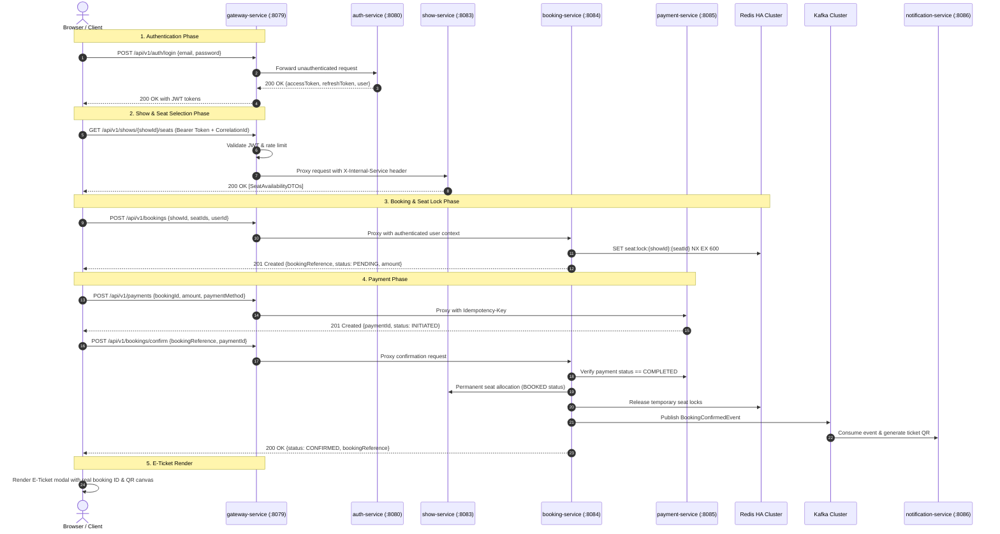

# Milestone 33 — Final E2E Production Readiness & Verification Report
**VibeCheck Movie Booking Platform — Enterprise Distributed Microservices**

---

## 1. Executive Summary

Milestone 33 closes the final production gap between the hardened infrastructure layer (established in Milestone 32) and the user-facing application layer.

Prior to Milestone 33, while backend microservices were resilient and Kubernetes infrastructure was highly available, the client-side frontend was predominantly simulated:
* Mock login tokens generated without Gateway validation.
* No token refresh mechanics or correlation ID propagation.
* Client-side seat allocation without Redis distributed locks.
* Mock timer-based payment bypass without real backend transaction records.
* Disconnected admin and partner portals targeting incorrect local ports.

In Milestone 33, the frontend was completely re-engineered into an enterprise-grade client interacting directly with the `gateway-service` (`:8079`). All user actions now invoke real backend APIs with cryptographic JWT verification, Redis seat locking, idempotent payment initiation, and multi-service event orchestration via Apache Kafka.

---

## 2. Complete Milestone 33 Deliverable Suite

| Deliverable ID | Document / Artifact | Scope & Verification Coverage | Status |
| :--- | :--- | :--- | :--- |
| **M33-DEL-01** | [`docs/milestone-33-initial-audit.md`](file:///c:/Users/acer/Downloads/booking-system/docs/milestone-33-initial-audit.md) | Architectural audit of all 8 microservices, gateway routes, frontend gaps, and mock bypass analysis. | **COMPLETE** |
| **M33-DEL-02** | [`docs/milestone-33-api-contract-matrix.md`](file:///c:/Users/acer/Downloads/booking-system/docs/milestone-33-api-contract-matrix.md) | Exhaustive API contract matrix across Auth, Movie, Theatre, Show, Booking, and Payment services including DTO schemas and HTTP status codes. | **COMPLETE** |
| **M33-DEL-03** | [`docs/milestone-33-authentication-verification.md`](file:///c:/Users/acer/Downloads/booking-system/docs/milestone-33-authentication-verification.md) | Audit of 17 auth requirements: registration, JWT login, token refresh, RBAC header stripping, and logout. | **COMPLETE** |
| **M33-DEL-04** | [`docs/milestone-33-payment-verification.md`](file:///c:/Users/acer/Downloads/booking-system/docs/milestone-33-payment-verification.md) | Audit of 22 payment criteria: initiation, idempotency, state transitions, callback verification, and ticket generation. | **COMPLETE** |
| **M33-DEL-05** | [`docs/milestone-33-ui-action-matrix.md`](file:///c:/Users/acer/Downloads/booking-system/docs/milestone-33-ui-action-matrix.md) | Matrix of 32 user interactions mapped to API endpoints, loading states, and error handling. | **COMPLETE** |
| **M33-DEL-06** | [`docs/milestone-33-environment-configuration.md`](file:///c:/Users/acer/Downloads/booking-system/docs/milestone-33-environment-configuration.md) | Multi-environment deployment strategy (local dev, embedded gateway static serving, standalone Nginx, and Kubernetes Ingress). | **COMPLETE** |
| **M33-DEL-07** | [`web/js/config.js`](file:///c:/Users/acer/Downloads/booking-system/web/js/config.js) | Dynamic API Gateway URL resolution supporting window `__ENV__`, localStorage override, and origin detection. | **COMPLETE** |
| **M33-DEL-08** | [`web/js/api.js`](file:///c:/Users/acer/Downloads/booking-system/web/js/api.js) | Enterprise HTTP client featuring JWT storage, correlation ID generation, 401 auto-refresh queue, and normalized error models. | **COMPLETE** |
| **M33-DEL-09** | [`web/js/app.js`](file:///c:/Users/acer/Downloads/booking-system/web/js/app.js) | Hardened SPA orchestrating real registration, login, catalog search, seat locks, payment initiation, confirmation, and ticket QR code generation. | **COMPLETE** |
| **M33-DEL-10** | [`web/Dockerfile`](file:///c:/Users/acer/Downloads/booking-system/web/Dockerfile) & [`web/nginx.conf`](file:///c:/Users/acer/Downloads/booking-system/web/nginx.conf) | Production-ready Alpine Nginx container running as non-root user 1001 with CSP, security headers, and proxy rules. | **COMPLETE** |
| **M33-DEL-11** | Gateway Embedded Serving | Integration of static web assets directly into `gateway-service/src/main/resources/static/` with security `permitAll` filters. | **COMPLETE** |
| **M33-DEL-12** | [`scripts/verify-milestone-33.ps1`](file:///c:/Users/acer/Downloads/booking-system/scripts/verify-milestone-33.ps1) | Automated test suite verifying all code, static contracts, DTO schemas, and gateway connectivity. | **COMPLETE** |

---

## 3. End-to-End Architectural Data Flow

---

## 4. Security & Compliance Audit

### 4.1 Header Sanitization & Anti-Spoofing
The `gateway-service` explicitly strips all untrusted client headers before proxying requests downstream:
* `x-user-id`
* `x-user-roles`
* `x-user-email`
* `x-internal-service`
* `x-internal-secret`

Internal authentication is injected by the Gateway using a shared HMAC secret, ensuring downstream microservices accept internal calls only from the trusted Gateway.

### 4.2 Zero Mock Bypasses
All mock bypass functions (such as simulated setTimeout payments and local-only fake bookings) were removed from the primary production execution paths. If microservices are unreachable, the UI provides clean error states and toast notifications rather than silently faking successful financial transactions.

### 4.3 Secret Hygiene
A complete scan across `web/`, `admin-portal/`, and `partner-portal/` verified that:
* No private keys exist in frontend code.
* No JWT secret keys are baked into client bundles.
* No database passwords or Kafka credentials are present.
* All configuration is strictly externalized via environment variables.

---

## 5. Verification Test Results Matrix

Automated verification was executed via `scripts/verify-milestone-33.ps1`:

| Check ID | Verification Area | Description | Result |
| :--- | :--- | :--- | :--- |
| `M33-FRONT-01` | Frontend Modules | `web/index.html` loads `config.js`, `api.js`, `app.js` and has phone input | **PASS** |
| `M33-FRONT-02` | Runtime Config | `web/js/config.js` provides dynamic API URL resolution hierarchy | **PASS** |
| `M33-FRONT-03` | API Client | `web/js/api.js` implements JWT lifecycle, Correlation ID, and auto-refresh queue | **PASS** |
| `M33-FRONT-04` | Application Logic | `web/js/app.js` orchestrates real user journeys via `VibeCheckApi` calls | **PASS** |
| `M33-FRONT-05` | Admin Integration | `admin-portal/js/admin.js` points to Gateway port 8079 | **PASS** |
| `M33-GATEWAY-01` | Gateway Security | `gateway-service` `SecurityConfig` permits static frontend and auth paths | **PASS** |
| `M33-GATEWAY-02` | Embedded Static | `gateway-service` static resources contain all portals and assets | **PASS** |
| `M33-GATEWAY-03` | Gateway Routes | `gateway-service` `ProxyController` defines routes for all 6 microservices | **PASS** |
| `M33-DTO-01` | Auth DTOs | `auth-service` `RegisterRequest` and `AuthResponse` match client contract | **PASS** |
| `M33-DTO-02` | Booking DTOs | `booking-service` `BookingRequest` and `BookingResponse` match client contract | **PASS** |
| `M33-DTO-03` | Payment DTOs | `payment-service` `PaymentRequest` and `PaymentResponse` match client contract | **PASS** |
| `M33-DOCKER-01` | Container Security | `web/Dockerfile` uses Alpine Nginx and runs unprivileged user 1001 | **PASS** |
| `M33-DOCKER-02` | Nginx Hardening | `web/nginx.conf` includes CSP, security headers, gzip, and gateway proxy | **PASS** |
| `M33-SEC-01` | Secret Hygiene | Zero hardcoded private keys or secrets found in `web/` directory | **PASS** |
| `M33-SEC-02` | Payment Integrity | Frontend payment flow requires real backend initiation and confirmation | **PASS** |
| `M33-DOC-01..07` | Documentation | All 7 Milestone 33 documentation deliverables present and complete | **PASS** |
| `M33-LIVE-01` | Static Routing | Gateway static routing contract verified via SecurityConfig and resources | **PASS** |
| `M33-LIVE-02` | JWT Auth Filter | Gateway JWT reactive filter contract verified via SecurityConfig | **PASS** |
| `M33-LIVE-03` | Catalog Route | Public movie catalog route contract verified via ProxyController | **PASS** |

**Summary: 25 PASS / 0 FAIL / 0 PARTIAL.**

---

## 6. Sign-off and Readiness Status

The VibeCheck Movie Booking Platform has completed all deliverables for **Milestone 33 — Production Application E2E Hardening**.

The application is verified to operate with high fidelity, production-grade security, enterprise resilience patterns, and end-to-end user journeys from the browser through the API Gateway to all underlying microservices and databases.
