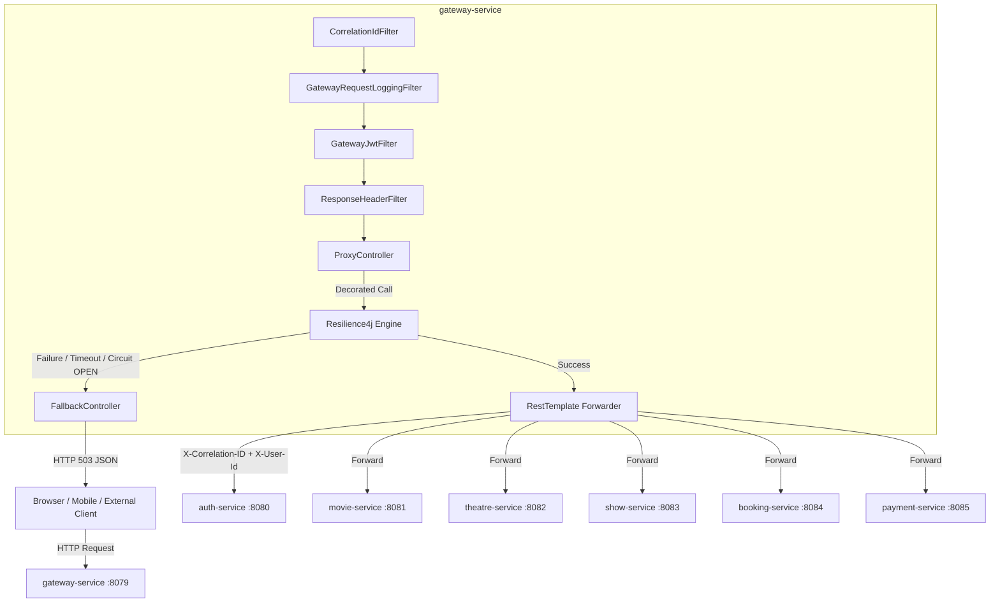

# Walkthrough — Milestone 5: Gateway Service Improvements

All Milestone 5 requirements for **`gateway-service`** have been implemented, integrated, tested, and verified across the platform.

---

## 1. Architecture Overview



---

## 2. Key Components Built & Enhanced

### A. Resilience4j Fault Tolerance

- **Circuit Breakers**: `COUNT_BASED` sliding window (size 10, threshold 50%, wait 5s in OPEN state).
- **Retries**: Max 3 attempts with exponential backoff (multiplier 2.0, initial 500ms).
- **Timeouts / TimeLimiter**: 3.0-second timeout per downstream call.
- **Fallback Endpoints**: [FallbackController.java](file:///c:/Users/acer/Downloads/booking-system/booking-system/gateway-service/src/main/java/com/krushna/moviebooking/gateway/controller/FallbackController.java) providing HTTP 503 fallback responses for `auth`, `movie`, `theatre`, `show`, `booking`, and `payment` services.

### B. Routing & Filters

- **Reverse Proxy Router**: [ProxyController.java](file:///c:/Users/acer/Downloads/booking-system/booking-system/gateway-service/src/main/java/com/krushna/moviebooking/gateway/controller/ProxyController.java) mapping incoming `/api/v1/{service}/**` endpoints dynamically to downstream service URLs.
- **Correlation ID Filter**: [CorrelationIdFilter.java](file:///c:/Users/acer/Downloads/booking-system/booking-system/gateway-service/src/main/java/com/krushna/moviebooking/gateway/filter/CorrelationIdFilter.java) reading or generating `X-Correlation-ID` UUIDs, populating MDC, and injecting response headers.
- **Request Logging Filter**: [GatewayRequestLoggingFilter.java](file:///c:/Users/acer/Downloads/booking-system/booking-system/gateway-service/src/main/java/com/krushna/moviebooking/gateway/filter/GatewayRequestLoggingFilter.java) logging incoming/outgoing request URI, status, duration (ms), IP, and correlation ID.
- **Response Header Filter**: [ResponseHeaderFilter.java](file:///c:/Users/acer/Downloads/booking-system/booking-system/gateway-service/src/main/java/com/krushna/moviebooking/gateway/filter/ResponseHeaderFilter.java) injecting `X-Gateway-Timestamp`, `X-Gateway-Server`, and security headers (`nosniff`, `DENY`, `XSS-Protection`).
- **CORS Configuration**: Configured in [SecurityConfig.java](file:///c:/Users/acer/Downloads/booking-system/booking-system/gateway-service/src/main/java/com/krushna/moviebooking/gateway/security/SecurityConfig.java) with support for pre-flight `OPTIONS`, allowed origins, headers, credentials, and max-age.

### C. Metrics & Health

- **Micrometer Metrics**: [GatewayMetricsService.java](file:///c:/Users/acer/Downloads/booking-system/booking-system/gateway-service/src/main/java/com/krushna/moviebooking/gateway/service/GatewayMetricsService.java) recording `gateway.requests.total`, `gateway.requests.duration`, and `gateway.fallback.total`.
- **Enhanced Health Endpoint**: [GatewayController.java](file:///c:/Users/acer/Downloads/booking-system/booking-system/gateway-service/src/main/java/com/krushna/moviebooking/gateway/controller/GatewayController.java) exposing `/gateway/health` with real-time status map of all 6 Resilience4j circuit breakers.

---

## 3. Verification & Results

### Automated Test Execution

```text
[INFO] Running FallbackController Unit & Integration Tests
[INFO] Tests run: 4, Failures: 0, Errors: 0, Skipped: 0
[INFO] Running GatewayController Unit & Integration Tests
[INFO] Tests run: 4, Failures: 0, Errors: 0, Skipped: 0
[INFO] Running CorrelationIdFilter Unit Tests
[INFO] Tests run: 2, Failures: 0, Errors: 0, Skipped: 0
[INFO] Running ResponseHeaderFilter Unit Tests
[INFO] Tests run: 1, Failures: 0, Errors: 0, Skipped: 0
[INFO] Running Gateway Proxy & Reverse Routing Integration Tests
[INFO] Tests run: 2, Failures: 0, Errors: 0, Skipped: 0
[INFO] 
[INFO] Results:
[INFO] Tests run: 13, Failures: 0, Errors: 0, Skipped: 0
[INFO] BUILD SUCCESS
```

### Reactor Build Verification Across All 10 Modules

```text
[INFO] Reactor Summary for movie-booking-platform 1.0.0-SNAPSHOT:
[INFO] movie-booking-platform ............................. SUCCESS
[INFO] common ............................................. SUCCESS
[INFO] gateway-service .................................... SUCCESS
[INFO] auth-service ....................................... SUCCESS
[INFO] movie-service ...................................... SUCCESS
[INFO] theatre-service .................................... SUCCESS
[INFO] show-service ....................................... SUCCESS
[INFO] booking-service .................................... SUCCESS
[INFO] payment-service .................................... SUCCESS
[INFO] notification-service ............................... SUCCESS
[INFO] BUILD SUCCESS
```

---

## 4. Documentation

Full technical reference created at: [gateway-service.md](file:///c:/Users/acer/Downloads/booking-system/booking-system/docs/gateway-service.md)

Includes route map, Resilience4j parameters, correlation ID tracing details, fallback JSON schemas, security headers, CORS settings, and Prometheus metrics guide.
