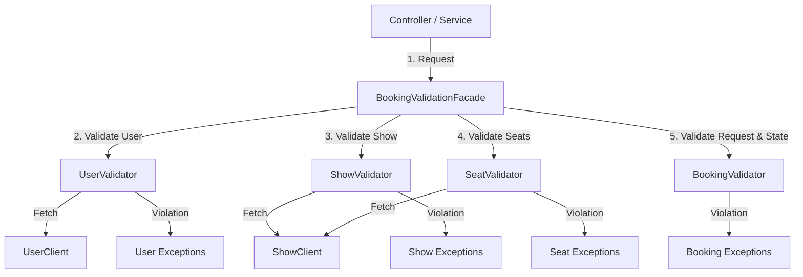

# Walkthrough - Booking Engine Validation Layer Implementation

The complete validation layer for the Movie Booking Platform's `booking-service` has been successfully implemented and verified. This layer introduces domain-specific validators for Booking, Seat, Show, and User rules, coordinated through a unified `BookingValidationFacade`.

---

## 1. Architecture Overview



---

## 2. Key Components Generated & Refactored

### A. Facade & Domain Validators
1. **[BookingValidationFacade](file:///c:/Users/acer/Downloads/booking-system/booking-system/booking-service/src/main/java/com/krushna/moviebooking/booking/validator/BookingValidationFacade.java)** & **[Impl](file:///c:/Users/acer/Downloads/booking-system/booking-system/booking-service/src/main/java/com/krushna/moviebooking/booking/validator/impl/BookingValidationFacadeImpl.java)**:
   - Coordinates end-to-end request validation for booking creation, confirmation, cancellation, and state transitions.

2. **[BookingValidator](file:///c:/Users/acer/Downloads/booking-system/booking-system/booking-service/src/main/java/com/krushna/moviebooking/booking/validator/BookingValidator.java)** & **[Impl](file:///c:/Users/acer/Downloads/booking-system/booking-system/booking-service/src/main/java/com/krushna/moviebooking/booking/validator/impl/BookingValidatorImpl.java)**:
   - Validates request structure, non-null fields, seat limits ($\le 10$), booking ownership, and state machine transition matrix (`CREATED`, `SEATS_LOCKED`, `PENDING`, `CONFIRMED`, `CANCELLED`, `EXPIRED`, `COMPLETED`).

3. **[SeatValidator](file:///c:/Users/acer/Downloads/booking-system/booking-system/booking-service/src/main/java/com/krushna/moviebooking/booking/validator/SeatValidator.java)** & **[Impl](file:///c:/Users/acer/Downloads/booking-system/booking-system/booking-service/src/main/java/com/krushna/moviebooking/booking/validator/impl/SeatValidatorImpl.java)**:
   - Validates seat existence, show membership, active status (rejects `BLOCKED`, `INACTIVE`, `DISABLED`), and availability status (`AVAILABLE`).

4. **[ShowValidator](file:///c:/Users/acer/Downloads/booking-system/booking-system/booking-service/src/main/java/com/krushna/moviebooking/booking/validator/ShowValidator.java)** & **[Impl](file:///c:/Users/acer/Downloads/booking-system/booking-system/booking-service/src/main/java/com/krushna/moviebooking/booking/validator/impl/ShowValidatorImpl.java)**:
   - Validates show existence, active status (`SCHEDULED`, `ACTIVE`, `OPEN`), and non-expired start times.

5. **[UserValidator](file:///c:/Users/acer/Downloads/booking-system/booking-system/booking-service/src/main/java/com/krushna/moviebooking/booking/validator/UserValidator.java)** & **[Impl](file:///c:/Users/acer/Downloads/booking-system/booking-system/booking-service/src/main/java/com/krushna/moviebooking/booking/validator/impl/UserValidatorImpl.java)**:
   - Validates user existence, active account status (`ACTIVE`), and role authorizations (`ROLE_CUSTOMER`).

---

### B. Inter-Service Clients
- **[UserClient](file:///c:/Users/acer/Downloads/booking-system/booking-system/booking-service/src/main/java/com/krushna/moviebooking/booking/client/UserClient.java)** & **[DefaultUserClient](file:///c:/Users/acer/Downloads/booking-system/booking-system/booking-service/src/main/java/com/krushna/moviebooking/booking/client/DefaultUserClient.java)**: User fetching & status verification client.
- **[ShowClient](file:///c:/Users/acer/Downloads/booking-system/booking-system/booking-service/src/main/java/com/krushna/moviebooking/booking/client/ShowClient.java)**: Extended `ShowDto` with `startTime` and `endTime` for expiration evaluation.

---

### C. Domain Exception Taxonomy & REST Mapping

| Exception | HTTP Status | Trigger Condition |
|-----------|-------------|-------------------|
| `UserNotFoundException` | `404 NOT_FOUND` | User ID not found in system |
| `UserInactiveException` | `403 FORBIDDEN` | User status is `INACTIVE` or `SUSPENDED` |
| `UserNotAuthorizedException` | `403 FORBIDDEN` | User missing required roles |
| `ShowNotFoundException` | `404 NOT_FOUND` | Show ID not found |
| `ShowInactiveException` | `400 BAD_REQUEST` | Show status is `CANCELLED` / inactive |
| `ShowExpiredException` | `400 BAD_REQUEST` | Show `startTime` is in past |
| `SeatNotFoundException` | `404 NOT_FOUND` | Seats do not exist for show |
| `SeatInactiveException` | `400 BAD_REQUEST` | Seats are `BLOCKED` or disabled |
| `SeatNotAvailableException` | `409 CONFLICT` | Seats are `LOCKED` or `BOOKED` |
| `InvalidBookingOwnershipException` | `403 FORBIDDEN` | Requesting user does not own booking |
| `InvalidBookingStateException` | `400 BAD_REQUEST` | Forbidden state machine transition |

All exceptions are registered with standardized JSON responses in [GlobalExceptionHandler.java](file:///c:/Users/acer/Downloads/booking-system/booking-system/booking-service/src/main/java/com/krushna/moviebooking/booking/exception/GlobalExceptionHandler.java).

---

## 3. Verification Results

### Automated Unit Tests
Executed via `mvn test -pl booking-service`:

```text
[INFO] Running com.krushna.moviebooking.booking.controller.BookingControllerTest
[INFO] Tests run: 9, Failures: 0, Errors: 0, Skipped: 0
[INFO] Running com.krushna.moviebooking.booking.service.BookingServiceImplTest
[INFO] Tests run: 14, Failures: 0, Errors: 0, Skipped: 0
[INFO] Running com.krushna.moviebooking.booking.service.RedisSeatLockServiceImplTest
[INFO] Tests run: 4, Failures: 0, Errors: 0, Skipped: 0
[INFO] Running com.krushna.moviebooking.booking.validator.BookingValidationFacadeTest
[INFO] Tests run: 3, Failures: 0, Errors: 0, Skipped: 0
[INFO] Running com.krushna.moviebooking.booking.validator.BookingValidatorTest
[INFO] Tests run: 11, Failures: 0, Errors: 0, Skipped: 0
[INFO] Running com.krushna.moviebooking.booking.validator.SeatValidatorTest
[INFO] Tests run: 5, Failures: 0, Errors: 0, Skipped: 0
[INFO] Running com.krushna.moviebooking.booking.validator.ShowValidatorTest
[INFO] Tests run: 4, Failures: 0, Errors: 0, Skipped: 0
[INFO] Running com.krushna.moviebooking.booking.validator.UserValidatorTest
[INFO] Tests run: 4, Failures: 0, Errors: 0, Skipped: 0
[INFO] 
[INFO] Results:
[INFO] Tests run: 54, Failures: 0, Errors: 0, Skipped: 0
[INFO] BUILD SUCCESS
```

### Workspace Compilation
Executed via `mvn compile` across all 10 modules (`common`, `gateway-service`, `auth-service`, `movie-service`, `theatre-service`, `show-service`, `booking-service`, `payment-service`, `notification-service`):

```text
[INFO] Reactor Summary for movie-booking-platform 1.0.0-SNAPSHOT:
[INFO] movie-booking-platform ............................. SUCCESS
[INFO] common ............................................. SUCCESS
[INFO] gateway-service .................................... SUCCESS
[INFO] auth-service ....................................... SUCCESS
[INFO] movie-service ...................................... SUCCESS
[INFO] theatre-service .................................... SUCCESS
[INFO] show-service ....................................... SUCCESS
[INFO] booking-service .................................... SUCCESS
[INFO] payment-service .................................... SUCCESS
[INFO] notification-service ............................... SUCCESS
[INFO] BUILD SUCCESS
```
